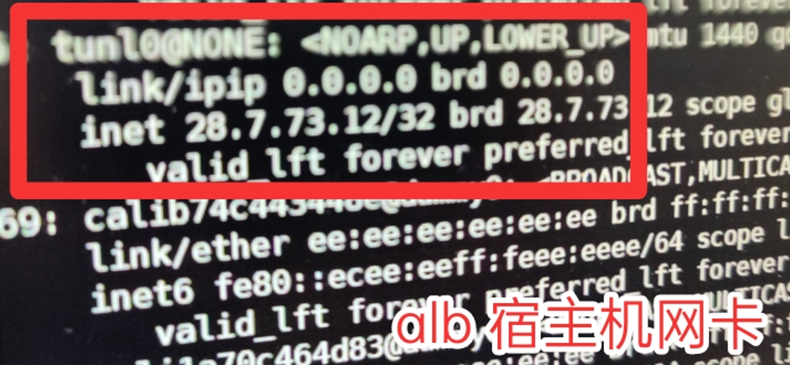
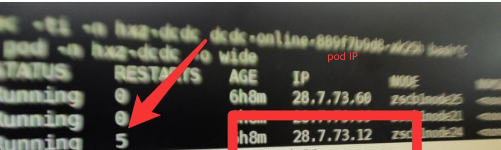
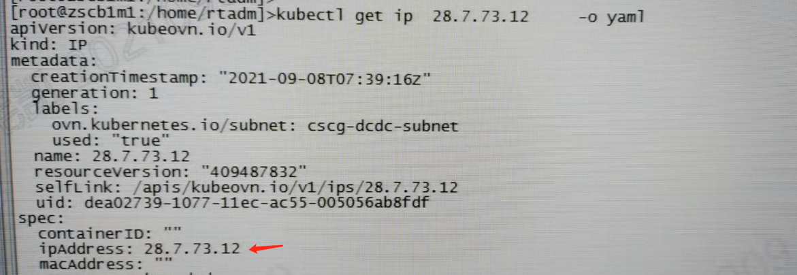
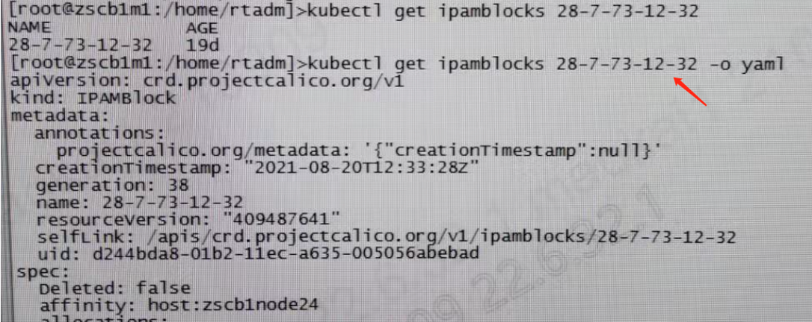
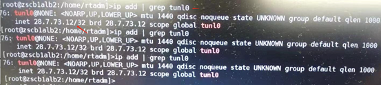
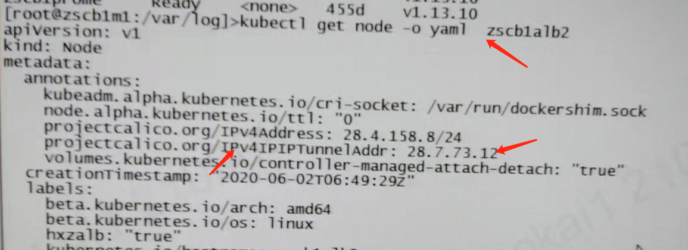
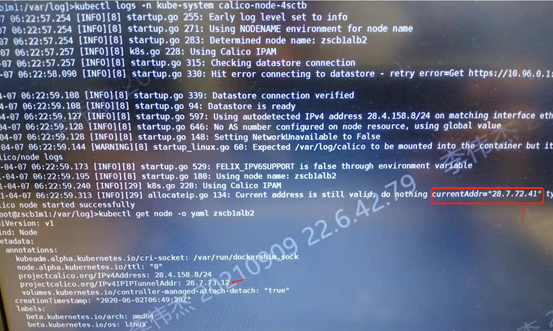
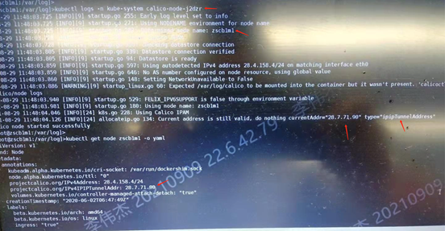
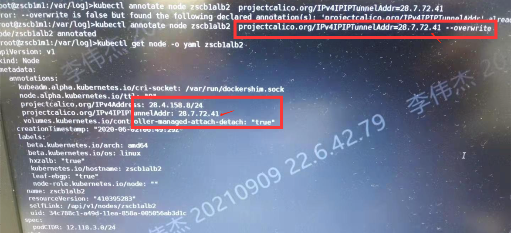
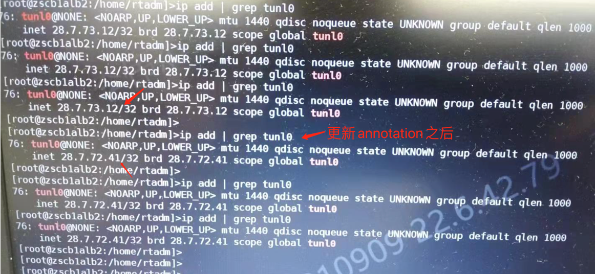

---
kind:
  - Troubleshooting
products:
  - Alauda Container Platform
  - Alauda DevOps
  - Alauda AI
  - Alauda Application Services
  - Alauda Service Mesh
  - Alauda Developer Portal
ProductsVersion:
  - 4.1.0,4.2.x
---
<!-- A type of document that involves encountering a fault, diagnosing it, performing root cause analysis, and providing solutions. -->

# 中信银行

业务Pod的IP地址与节点tunl0网卡IP冲突（均为28.7.73.12） ALB负载不均衡导致其中一个Pod未收到请求

## Cause
- 异常节点的IPv4IPIPTunnelAddr注解错误指定了28.7.73.12地址，与Pod IP冲突

## Resolution
- 修改异常节点的IPv4IPIPTunnelAddr注解值为Calico分配的28.7.72.41地址

## [workaround]

## [Related Information]
**Screenshots**

- Environment: ACP 2.6
- tunl0网卡
- IPv4IPIPTunnelAddr注解
- calico-node日志
- ipamblock
- alb负载均衡
- Component: alb
- Page ID: 94878076
- Original Title: 中信银行—alb节点tunl0与Pod IP地址冲突问题
