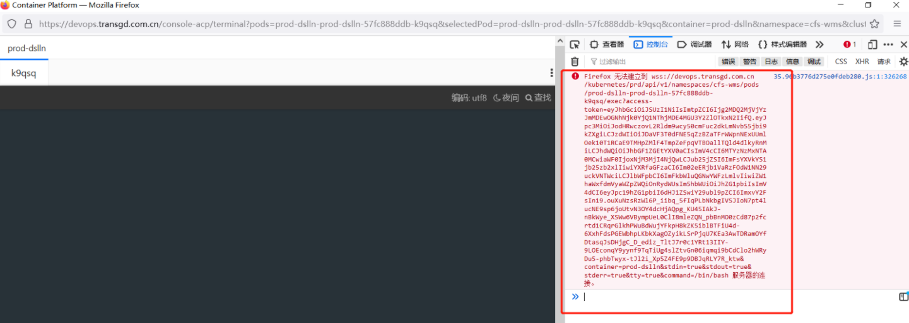

---
kind:
  - Troubleshooting
products:
  - Alauda Container Platform
  - Alauda DevOps
  - Alauda AI
  - Alauda Application Services
  - Alauda Service Mesh
  - Alauda Developer Portal
ProductsVersion:
  - 4.1.0,4.2.x
---
<!-- A type of document that involves encountering a fault, diagnosing it, performing root cause analysis, and providing solutions. -->

# 平台EXEC功能异常

2. 期间可查看global集群的alb日志 exec相关日志是否有报错进行分析判断；

## Cause

## Resolution
- 1. 咨询客户有无设置网络代理（exec连接需要开启websocket的支持）；
- 3. 咨询客户使用浏览器版本，感觉部署要求使用适配谷歌浏览器进行测试，发现问题同样存在；
- 4. 客户反馈访问有使用代理且没有开启websocket的支持
- ## 解决方案
- 客户将代理开启websocket的支持后，EXEC功能连接恢复

## [workaround]

## [Related Information]
**Screenshots**

- 11
- 19
- 38
- /ping-tai-execgong-neng-yi-chang-f12cha-kan-ti-shi-wu-fa-lian-jie/image2021-11-19_10-19-38.png
- Component: alb
- Page ID: 98879841
- Original Title: 平台EXEC功能异常-F12查看提示无法连接
