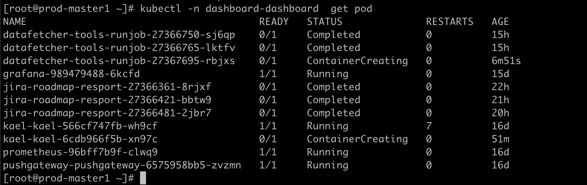
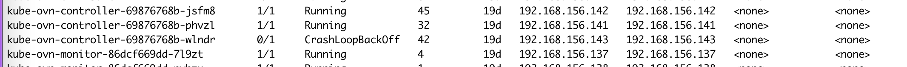
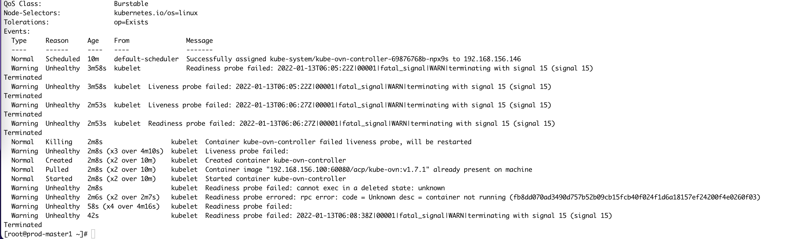
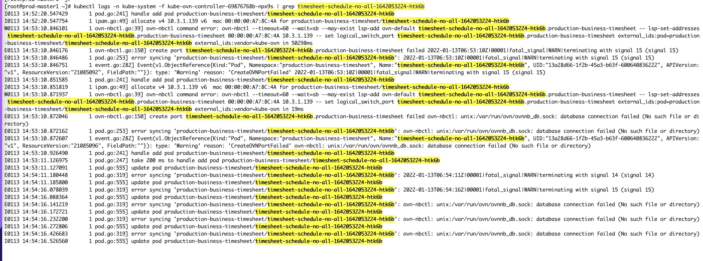
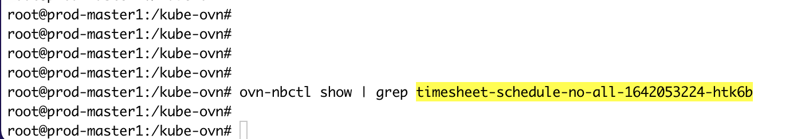
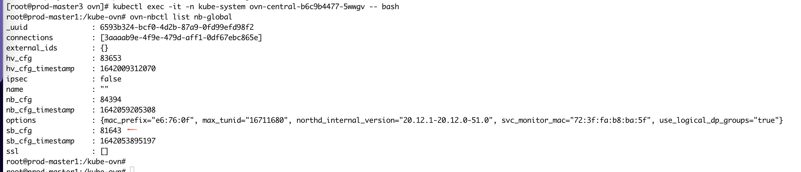
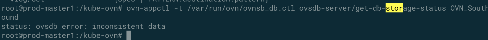
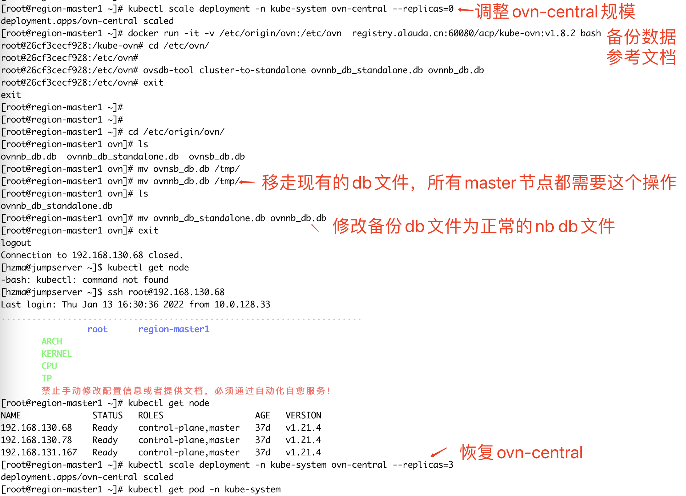

---kind:   - Troubleshootingproducts:    - Alauda Container Platform   - Alauda DevOps   - Alauda AI   - Alauda Application Services   - Alauda Service Mesh   - Alauda Developer PortalProductsVersion:   - 4.1.0,4.2.x---<!-- A type of document that involves encountering a fault, diag...it, performing root cause analysis, and providing solutions. --># SB DB 数据不一致，导致pod创建一直失败Pod处于ContainerCreating状态无法Running kube-ovn-controller多次重启 ovn-nbctl lr-list命令执行失败## Cause- OVN_SB数据库同步异常导致nb_cfg/sb_cfg不一致## Resolution- 备份NB DB- 删除所有master节点/etc/origin/ovn/ovnsb_db.db- 执行ovsdb-tool cluster-to-standalone转换数据库- 重启ovn-central组件: kubectl scale deployment -n kube-system ovn-central --replicas=0/3## [workaround]## [Related Information]**Screenshots**- Environment: Kube-OVN v1.8.2(Edge)/v1.7.1(IDC), Kubernetes v1.21.4- kube-ovn-controller- ovn-nbctl- ovn-appctl- /etc/origin/ovn- 10660端口- OVN_NB_DAEMON- ovnsb_db.ctl- Component: kube-ovn- Page ID: 103813589- Original Title: SB DB 数据不一致，导致pod创建一直失败