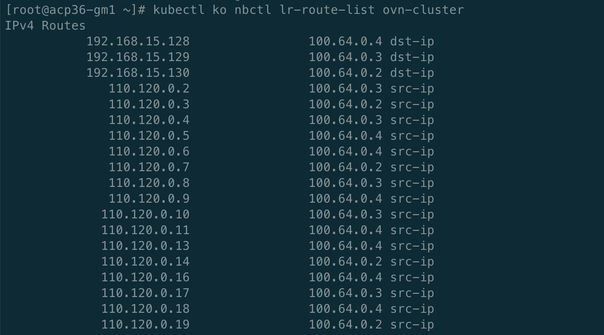

---
kind:
  - Troubleshooting
products:
  - Alauda Container Platform
  - Alauda DevOps
  - Alauda AI
  - Alauda Application Services
  - Alauda Service Mesh
  - Alauda Developer Portal
ProductsVersion:
  - 4.1.0,4.2.x
---
<!-- A type of document that involves encountering a fault, diagnosing it, performing root cause analysis, and providing solutions. -->

# ovn1.3版本无法启动

ovn组件无法启动 恢复db后pod网络不通

## Cause
- ovn-central数据库受损
- 无法保证多数节点正常

## Resolution
- kubectl scale deployment -n kube-system ovn-central --replicas=0
- 使用ovsdb-tool cluster-to-standalone恢复数据库文件
- mv /etc/origin/ovn/ovnnb_db_standalone.db /etc/origin/ovn/ovnnb_db.db
- kubectl scale deployment -n kube-system ovn-central --replicas={原副本数}
- kubectl ko nbctl lsp-add join node-NODENAME -- lsp-set-addresses node-NODENAME "OVN0MAC OVN0IP"
- kubectl ko nbctl --policy=dst-ip lr-route-add ovn-cluster 192.168.16.91 100.64.0.3

## [workaround]

## [Related Information]
**Screenshots**
[kubectl-ko](/download/attachments/112036717/kubectl-ko?version=1&modificationDate=1648175365000&api=v2)

- Environment: acp3.0.4, ovn1.3.0
- ovn-central
- /etc/origin/ovn/ovnnb_db.db
- /etc/origin/ovn/ovnsb_db.db
- join子网
- ovn-cluster路由表
- kubectl-ko插件
- kube-ovn-cni
- kube-ovn-controller
- Component: kube-ovn
- Page ID: 112036717
- Original Title: ovn1.3版本无法启动
