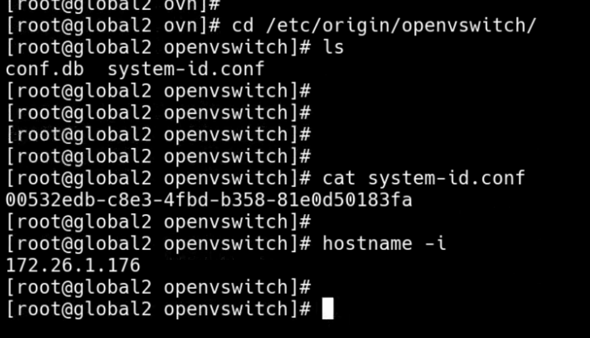

---kind:   - Troubleshootingproducts:    - Alauda Container Platform   - Alauda DevOps   - Alauda AI   - Alauda Application Services   - Alauda Service Mesh   - Alauda Developer PortalProductsVersion:   - 4.1.0,4.2.x---<!-- A type of document that involves encountering a fault, diag...it, performing root cause analysis, and providing solutions. --># Kube业务pod无法ping通子网网关 network not ready after 200错误 仅影响重启节点上的pod## Cause- 节点重启后华为安全组件限制网关访问## Resolution- 停止/卸载华为安全组件## [workaround]- kill安全组件进程临时恢复## [Related Information]**Screenshots**- Environment: Kube-OVN v1.6.2/TKE/华为云主机- ovn-nb- ovn-sb- kubectl ko插件- /etc/origin/openvswitch/system-id.conf- 子网网关- 安全组件- Component: kube-ovn- Page ID: 112041090- Original Title: Kube-OVN CNI报错，业务pod ping不通网关