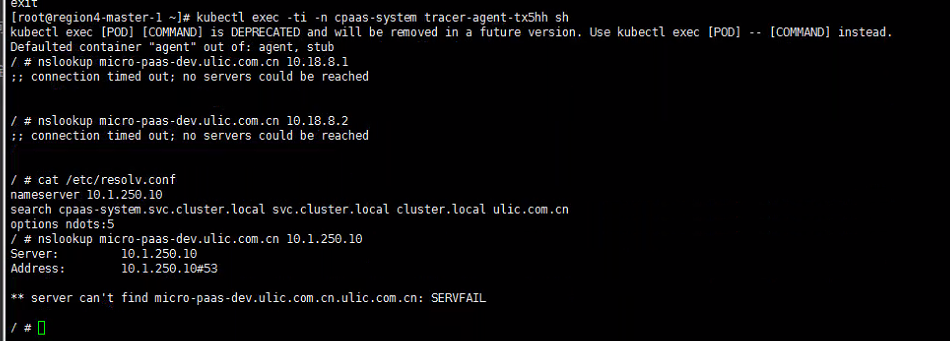
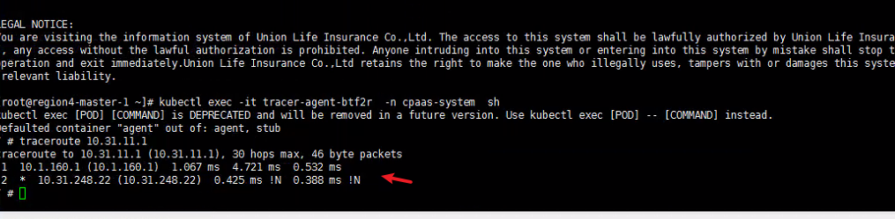
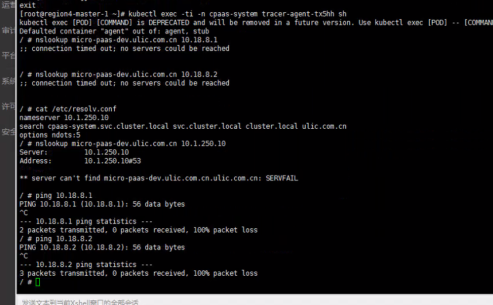

---
kind:
  - Troubleshooting
products:
  - Alauda Container Platform
  - Alauda DevOps
  - Alauda AI
  - Alauda Application Services
  - Alauda Service Mesh
  - Alauda Developer Portal
ProductsVersion:
  - 4.1.0,4.2.x
---
<!-- A type of document that involves encountering a fault, diagnosing it, performing root cause analysis, and providing solutions. -->

# 3.6.2

外网业务集群平台日志和事件不显示数据 tracer-agent容器内curl无法解析域名 underlay外网业务集群容器内无法ping通平台访问地址

## Cause
- 容器网段与nameserver ip之间存在网络策略限制
- underlay外网业务集群到平台访问地址存在路由问题

## Resolution
- 开通外网underlay业务集群容器网段与nameserver ip的网络策略
- 修复underlay外网业务集群到平台访问地址的路由问题

## [workaround]

## [Related Information]
**Screenshots**

- Environment: 3.6.2
- kube-ovn
- nevermore组件
- tracer-agent
- /etc/td-agent/fluentd-log-match.conf
- endpoint_url
- /etc/resolv.conf
- Component: kube-ovn
- Page ID: 112041831
- Original Title: 3.6.2-基础设施-网络-业务集群日志和事件不显示
