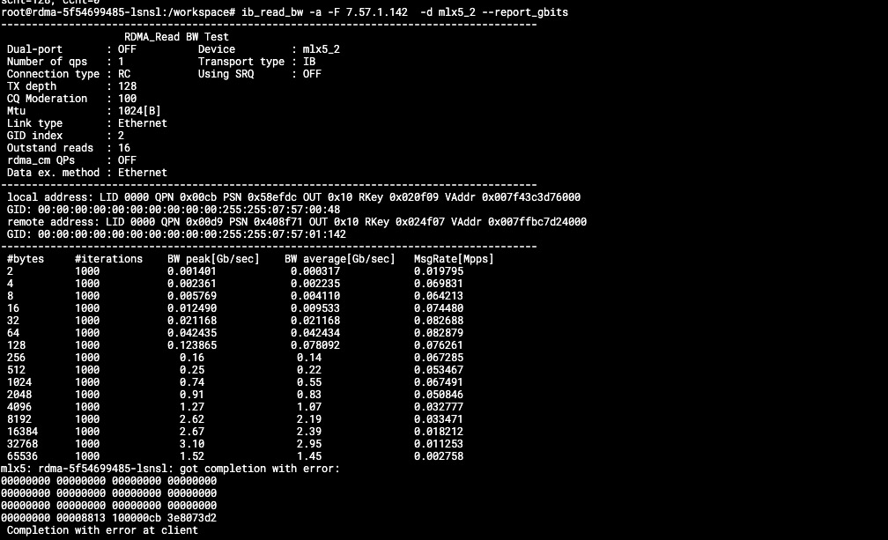
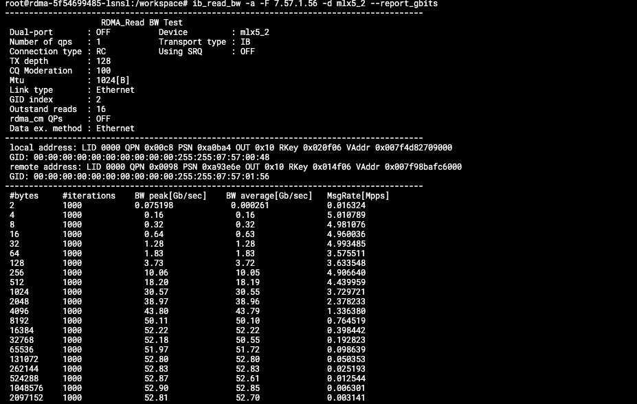
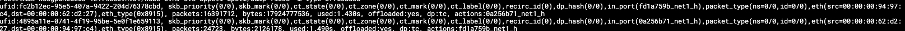
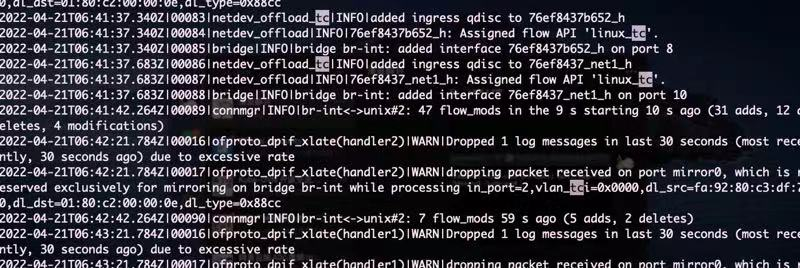

---kind:   - Troubleshootingproducts:    - Alauda Container Platform   - Alauda DevOps   - Alauda AI   - Alauda Application Services   - Alauda Service Mesh   - Alauda Developer PortalProductsVersion:   - 4.1.0,4.2.x---<!-- A type of document that involves encountering a fault, diag...it, performing root cause analysis, and providing solutions. --># 智能网卡跨节点带宽低且无流表卸载跨节点 Pod 带宽极低 执行 ovs-appctl dpctl/dump-flows -m type=offloaded 无卸载流表 同节点 Pod 间带宽正常且流表卸载正常## Cause- 使用智能网卡 pf 做的 bond 网口导致流表卸载异常## Resolution- 删除 bond 网口直接使用智能网卡 pf- 按官方文档要求：在 pf 配置完 e-switch 后再做 bond## [workaround]- 临时删除 bond 网口直接使用智能网卡 pf## [Related Information]**Screenshots**- ovs-appctl dpctl/dump-flows -m type=offloaded- geneve 网卡- bond 接口- tc 卸载- Mellanox CX5 智能网卡- Component: Kubernetes- Page ID: 112058538- Original Title: 智能网卡跨节点带宽低且无流表卸载