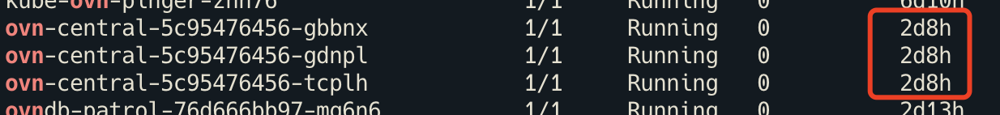
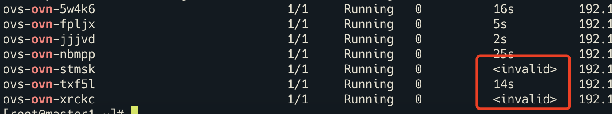
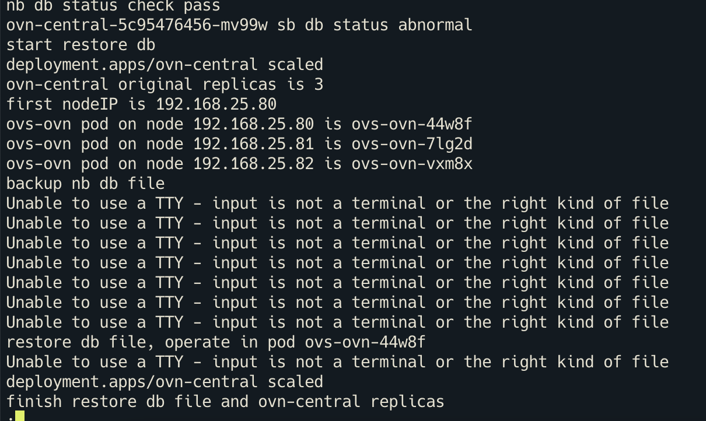

---kind:   - Troubleshootingproducts:    - Alauda Container Platform   - Alauda DevOps   - Alauda AI   - Alauda Application Services   - Alauda Service Mesh   - Alauda Developer PortalProductsVersion:   - 4.1.0,4.2.x---<!-- A type of document that involves encountering a fault, diag...it, performing root cause analysis, and providing solutions. --># SB 数据库异常，ovnkube-ovn-controller 报错 duplicate chassis for node 192.168.25.81 and new chassis kubectl ko sbctl show 和 sbctl list chassis 结果为空 ovn-central Pod 在2天前重建过## Cause- ovn 数据库自动恢复操作后状态不一致- 节点间时间不同步导致数据库同步问题## Resolution- 手动重建 ovs-ovn Pod- 执行 /usr/share/ovn/scripts/ovn-ctl restart_controller- 检查并同步所有节点时间## [workaround]- ovn-appctl -t ovn-controller sb-cluster-state-reset- ovn-appctl -t ovn-northd nb-cluster-state-reset- ovn-appctl -t ovn-northd sb-cluster-state-reset## [Related Information]**Screenshots**- Environment: CNI: kube-ovn v1.8.4, ACP v3.8- 6642- ovn-central- ovn-controller- kubectl ko sbctl show- sb-cluster-state-reset- nb-cluster-state-reset- Component: kube-Ovn- Page ID: 112060192- Original Title: SB 数据库异常，ovn-controller 报错 clustered database server has stale data