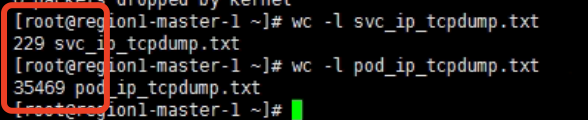

---kind:   - Troubleshootingproducts:    - Alauda Container Platform   - Alauda DevOps   - Alauda AI   - Alauda Application Services   - Alauda Service Mesh   - Alauda Developer PortalProductsVersion:   - 4.1.0,4.2.x---<!-- A type of document that involves encountering a fault, diag...it, performing root cause analysis, and providing solutions. --># Underlay 通过 Service IP 访问 Pod 带宽极低通过 Service IP 访问 Pod 带宽约为 400 KB/s 直接使用 Pod IP 访问带宽为 110 MB/s Client 端发出的包数量明显大于 Server 端接收到的数量## Cause- OVN LB 的 DNAT 未修改 dst MAC，导致流量发往物理网关- 物理网关可能限速、存在性能瓶颈或配置了防火墙丢包## Resolution- 关闭网关的 ip redirect 功能## [workaround]## [Related Information]**Screenshots**- Service IP- OVN LB- DNAT- ICMP Redirect- 物理网关- tcpdump 抓包命令- Component: Kubernetes- Page ID: 112064602- Original Title: Underlay 通过 Service IP 访问 Pod 带宽极低