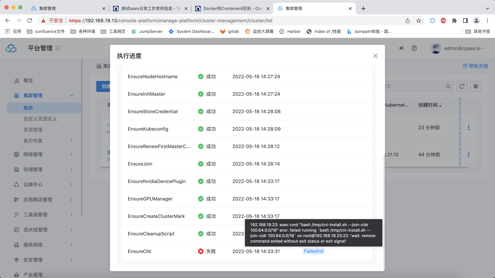
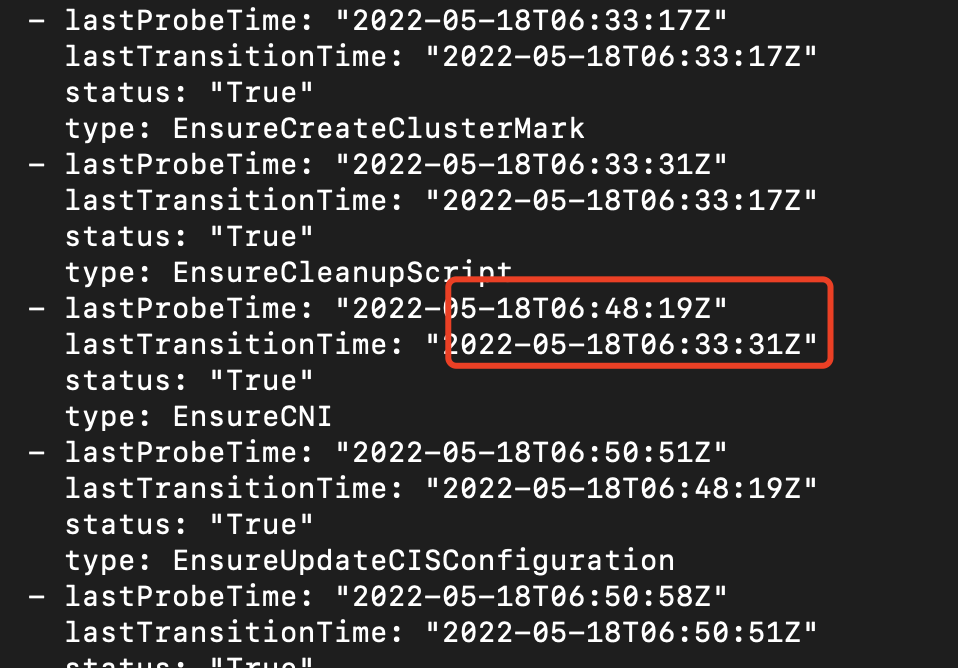
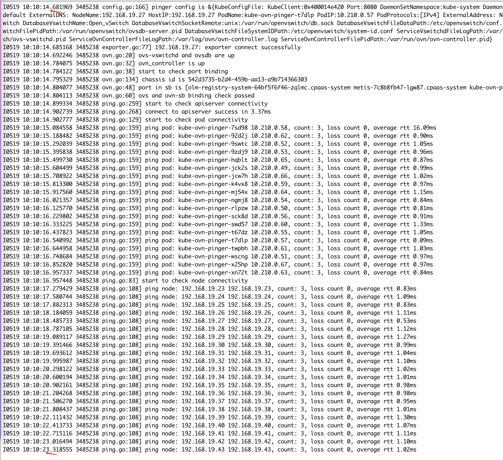

---kind:   - Troubleshootingproducts:    - Alauda Container Platform   - Alauda DevOps   - Alauda AI   - Alauda Application Services   - Alauda Service Mesh   - Alauda Developer PortalProductsVersion:   - 4.1.0,4.2.x---<!-- A type of document that involves encountering a fault, diag...it, performing root cause analysis, and providing solutions. --># ACP部署新集群，kubeCNI安装步骤报错 安装耗时约15分钟 手动执行kubectl ko diagnose all时pinger pod诊断耗时较长## Cause- kube-ovn的ko插件诊断执行耗时- 安装过程中诊断信息不可见导致无法及时反馈进度## Resolution- 优化安装过程的诊断信息展示机制- 调整kube-ovn-pinger诊断模式或并行处理## [workaround]## [Related Information]**Screenshots**- Environment: ARM环境- kube-ovn组件- pinger pod- cni-kube-ovn ConfigMap- cpaas-system命名空间- tke-platform-controller- kubectl ko diagnose all命令- Component: kube-ovn- Page ID: 115519832- Original Title: ACP部署新集群，kube-ovn cni安装步骤时间较长