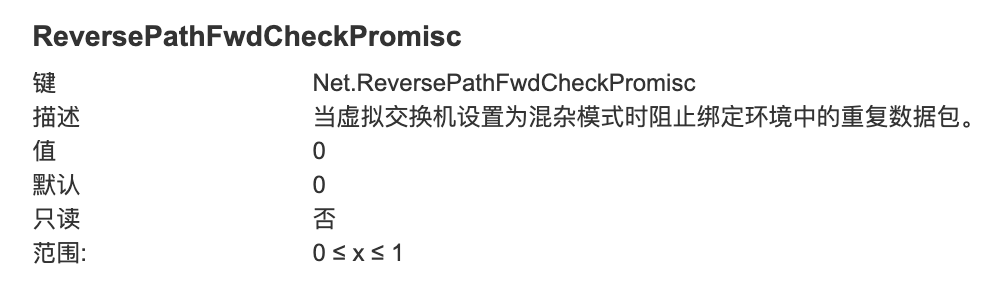

---kind:   - Troubleshootingproducts:    - Alauda Container Platform   - Alauda DevOps   - Alauda AI   - Alauda Application Services   - Alauda Service Mesh   - Alauda Developer PortalProductsVersion:   - 4.1.0,4.2.x---<!-- A type of document that involves encountering a fault, diag...it, performing root cause analysis, and providing solutions. --># Underlay 跨节点 Pod 之间无法正常通信Underlay 跨节点 Pod 之间连接超时，ICMP 卡顿或出现 DUP 包 异常流表中存在 actions:drop 条目 ovs-dpctl 显示 port 5(ens224) 出现源 MAC 00:00:00:49:aa:3a 的异常入向流量## Cause- VMWare 双网卡 bond 导致重复报文- 从外部网络进入 ens224 的重复报文引发 OVS fdb 表异常## Resolution- 在 VMWare 主机设置 Net.ReversePathFwdCheckPromisc=1- 检查物理机 bond 模式配置## [workaround]- 临时关闭 bond 的一个网卡: ifdown <interface>- 将虚拟机调度到不同 VMWare 主机## [Related Information]**Screenshots**- Environment: VMWare 虚拟机集群/Kubernetes/OVS- ens224- ovs-dpctl- br-provider- fdb- bond1- Net.ReversePathFwdCheckPromisc- vlan 32- Component: kube-Ovn- Page ID: 115528873- Original Title: Underlay 跨节点 Pod 之间无法正常通信