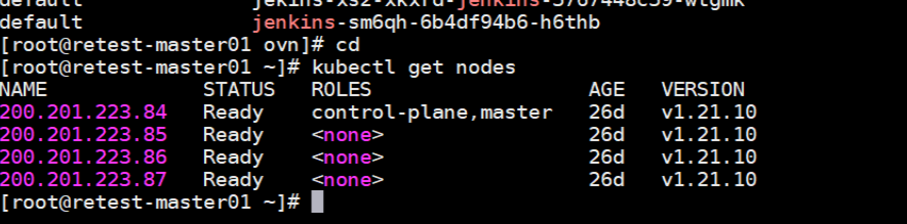
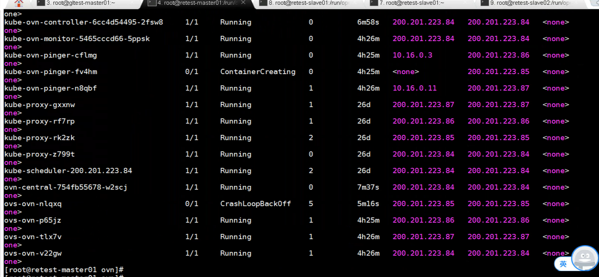
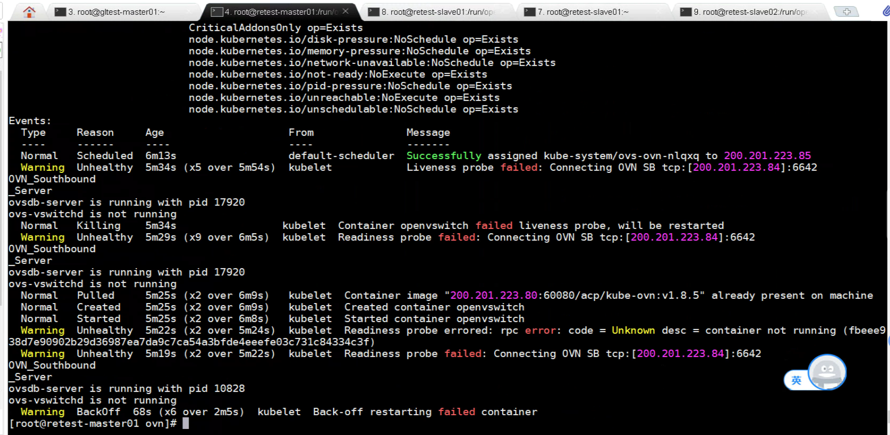
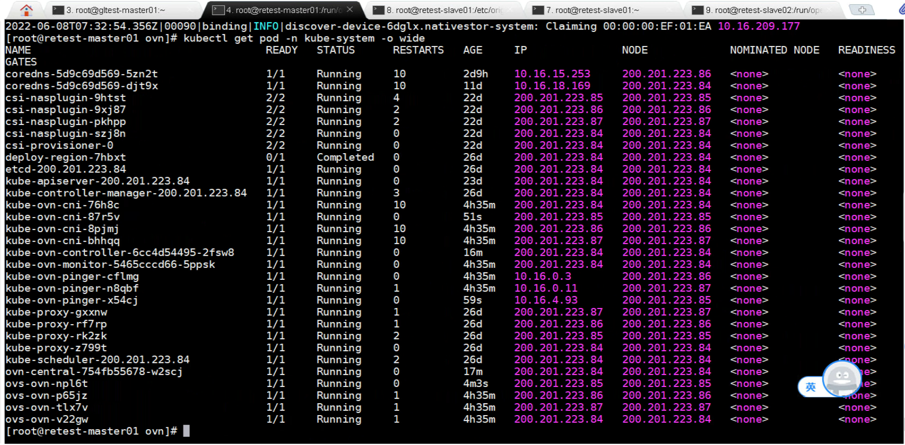

---kind:   - Troubleshootingproducts:    - Alauda Container Platform   - Alauda DevOps   - Alauda AI   - Alauda Application Services   - Alauda Service Mesh   - Alauda Developer PortalProductsVersion:   - 4.1.0,4.2.x---<!-- A type of document that involves encountering a fault, diag...it, performing root cause analysis, and providing solutions. --># 20220608ovs-ovn pod启动失败 日志显示无法连接ovn sb db kubectl sbctl show缺少问题节点chassis信息## Cause- 原有DB文件(conf.db)残留导致连接异常## Resolution- rm /etc/origin/openvswitch/conf.db- kubectl delete pod <ovs-ovn-pod-name> --force## [workaround]## [Related Information]**Screenshots**- Environment: ACP 3.8.1/Kube-OVN v1.8.5- ovn sb db- /etc/origin/openvswitch/conf.db- kube-ovn- ovs-ovn pod- Component: Kubernetes- Page ID: 115530852- Original Title: 20220608-深信服ovs-ovn pod启动异常