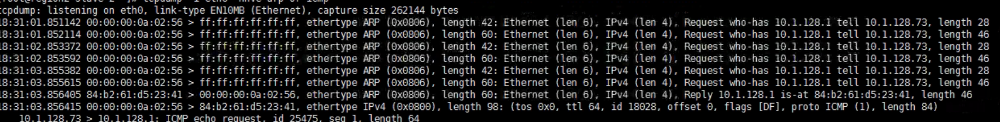
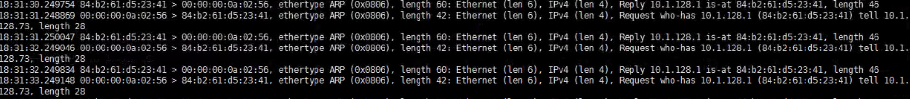
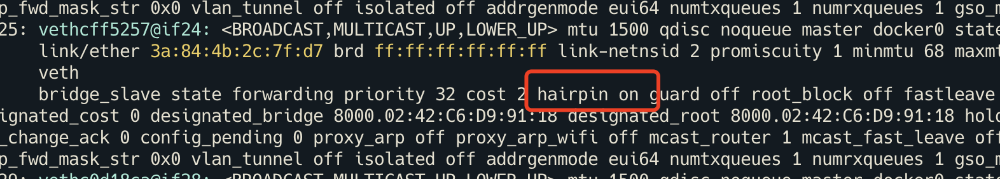

---kind:   - Troubleshootingproducts:    - Alauda Container Platform   - Alauda DevOps   - Alauda AI   - Alauda Application Services   - Alauda Service Mesh   - Alauda Developer PortalProductsVersion:   - 4.1.0,4.2.x---<!-- A type of document that involves encountering a fault, diag...it, performing root cause analysis, and providing solutions. --># Underlay 模式 Pod 长时间处于 ContainerCreating 状态Pod 长时间处于 ContainerCreating 状态 同一时间存在源 MAC 相同的重复 ARP 请求 OVS fdb 中 Pod MAC 对应的 Port 不正确## Cause- OVS fdb 表错误更新导致 ARP 响应被丢弃- ARP 广播包被送回节点网卡触发错误 fdb 更新- VMWare 网络配置问题## Resolution- 关闭交换机/网桥的 hairpin 功能- 在 VMWare 中设置 Net.ReversePathFwdCheckPromisc=1## [workaround]## [Related Information]**Screenshots**- Environment: Kubernetes 节点为 VMWare 虚拟机- OVS fdb- ARP- ICMP- Net.ReversePathFwdCheckPromisc- hairpin 模式- Component: Kubernetes- Page ID: 115533013- Original Title: Underlay 模式 Pod 长时间处于 ContainerCreating 状态