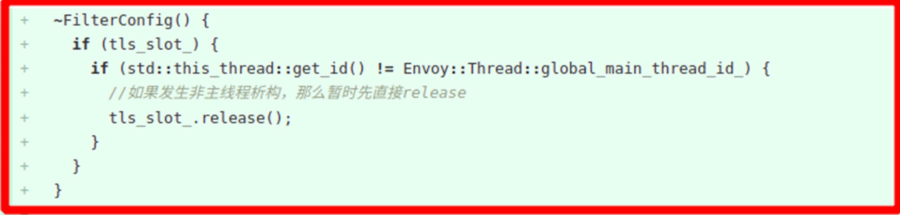
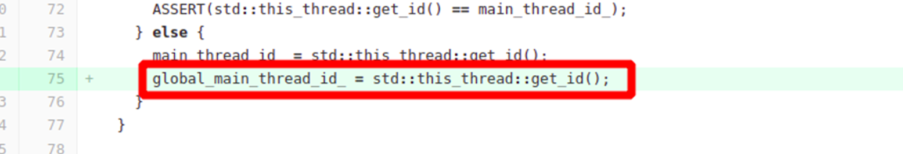

---
kind:
  - Troubleshooting
products:
  - Alauda Container Platform
  - Alauda DevOps
  - Alauda AI
  - Alauda Application Services
  - Alauda Service Mesh
  - Alauda Developer Portal
ProductsVersion:
  - 4.1.0,4.2.x
---
<!-- A type of document that involves encountering a fault, diagnosing it, performing root cause analysis, and providing solutions. -->

# OVN网络

微服务应用设置固定ip后频繁触发重启 绑定特定子网ip（6个特定ip地址）时出现问题，其他子网ip或无绑定则正常 执行arping问题ip无反馈，说明ip未被局域网占用

## Cause
- sidecar服务自身代码中wasm设置引起的服务重启行为

## Resolution
- 修复服务自身代码相关判断逻辑

## [workaround]

## [Related Information]
**Screenshots**

- Environment: 3.6.1 OVN 1.7.3 underlay模式/istio 1.12/物理机节点
- kubectl get ips
- arping
- tcpdump -i eth0 -nnve arp
- provider-network
- ovs-appctl dpctl/dump-flows
- wasm配置
- Component: kube-Ovn
- Page ID: 119079717
- Original Title: OVN网络-underlay模式-微服务应用sidecar服务设置固定ip后频繁触发重启
