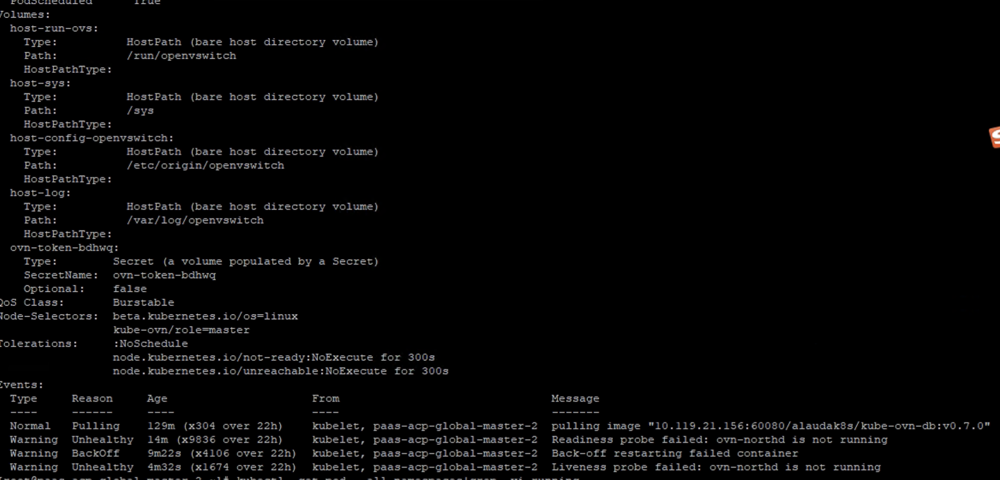
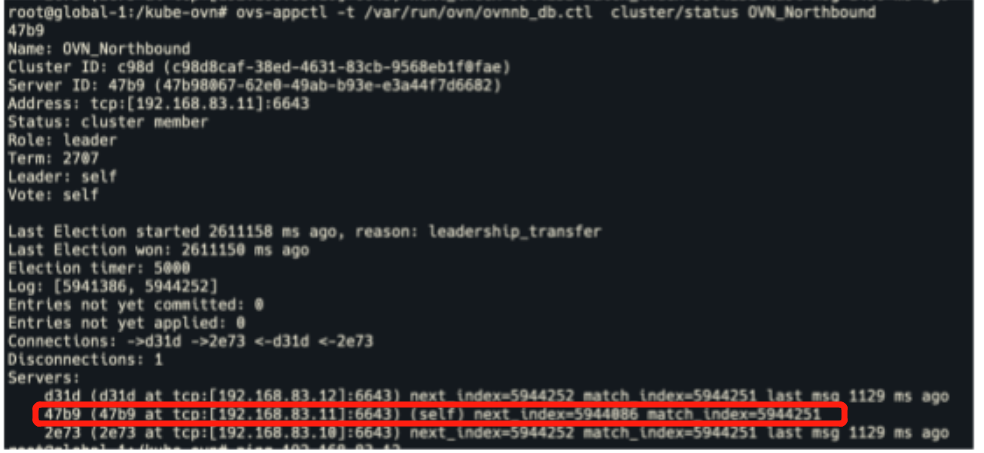

---
kind:
  - Troubleshooting
products:
  - Alauda Container Platform
  - Alauda DevOps
  - Alauda AI
  - Alauda Application Services
  - Alauda Service Mesh
  - Alauda Developer Portal
ProductsVersion:
  - 4.1.0,4.2.x
---
<!-- A type of document that involves encountering a fault, diagnosing it, performing root cause analysis, and providing solutions. -->

# 单个ovn

Liveness probe failed: ovn-northd is not running Root directory storage usage reached 100%

## Cause
- OVN database cluster status anomaly (e.g., missing last msg records in Servers)
- Storage full leading to data write failure

## Resolution
- Check NB/SB database cluster status via: ovs-appctl -t /var/run/ovn/ovnnb_db.ctl cluster/status OVN_Northbound and ovs-appctl -t /var/run/ovn/ovnsb_db.ctl cluster/status OVN_Southbound
- Kick abnormal server from cluster: ovs-appctl -t /var/run/ovn/ovnnb_db.ctl cluster/kick OVN_Northbound <ID> or ovs-appctl -t /var/run/ovn/ovnsb_db.ctl cluster/kick OVN_Southbound <ID>
- Delete database files: mv /etc/origin/ovn/ovnnb_db.db /tmp or mv /etc/origin/ovn/ovnsb_db.db /tmp
- Delete and recreate the problematic ovn-central Pod

## [workaround]

## [Related Information]
**Screenshots**

- Environment: 通用
- ovn-central Pod
- ovn-nb endpoint
- ovn-sb endpoint
- /var/run/ovn/ovnnb_db.ctl
- /var/run/ovn/ovnsb_db.ctl
- /etc/origin/ovn/ovnnb_db.db
- /etc/origin/ovn/ovnsb_db.db
- Component: kube-Ovn
- Page ID: 120107376
- Original Title: 单个ovn-central服务无法启动-查看pod事件报错Liveness probe failed : ovn-northd is not running
