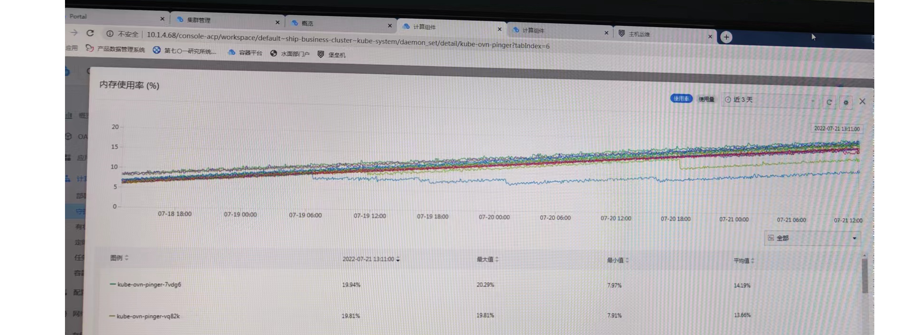
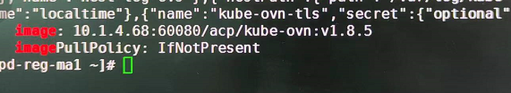
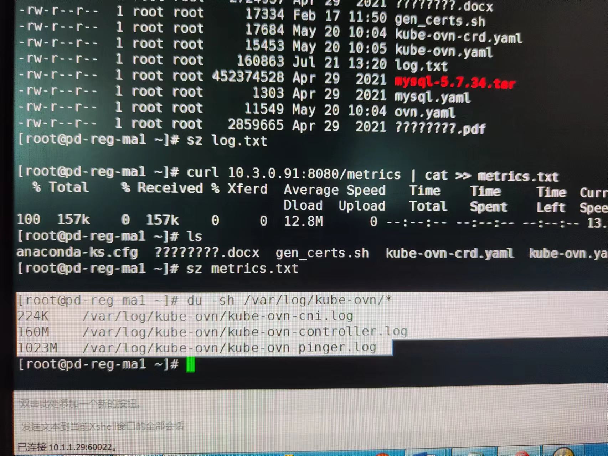
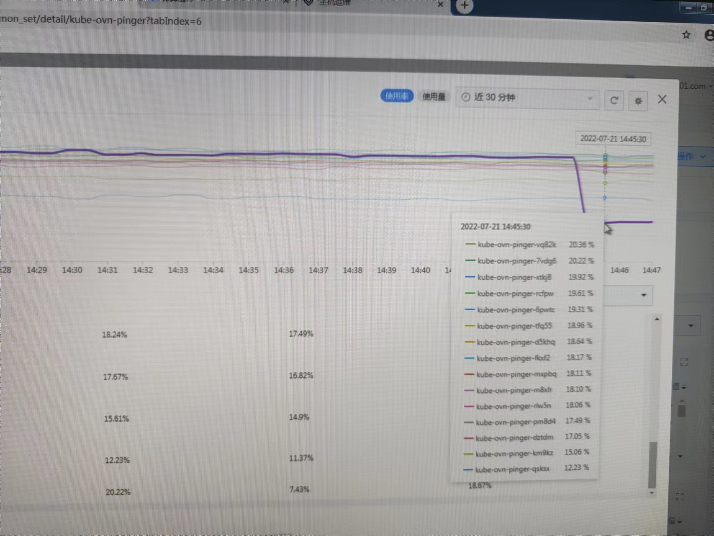

---kind:   - Troubleshootingproducts:    - Alauda Container Platform   - Alauda DevOps   - Alauda AI   - Alauda Application Services   - Alauda Service Mesh   - Alauda Developer PortalProductsVersion:   - 4.1.0,4.2.x---<!-- A type of document that involves encountering a fault, diag...it, performing root cause analysis, and providing solutions. --># 2022pinger pod内存占用持续增长超过400M 删除节点日志文件后内存占用下降## Cause- 日志文件未正确轮转导致内存增长## Resolution- 在Kube-OVN 1.8/1.9版本中回合logrotate相关代码变更## [workaround]- 手动删除节点上的pinger日志文件## [Related Information]**Screenshots**- Environment: ACP3.8.1/k8s1.21/Kube-OVN1.8.5- pinger pod- logrotate- Kube-OVN- /var/run/ovn/pinger.log- Component: kube-Ovn- Page ID: 120109952- Original Title: 2022-7-21 acp 3.8.1 pinger pod占用内存增长