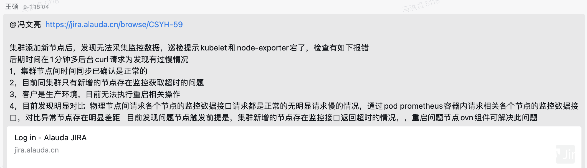
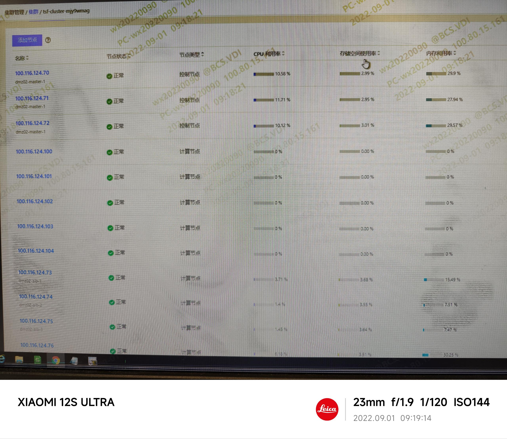
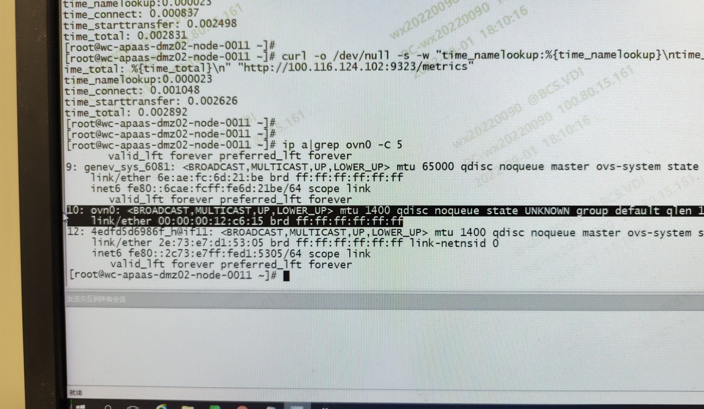
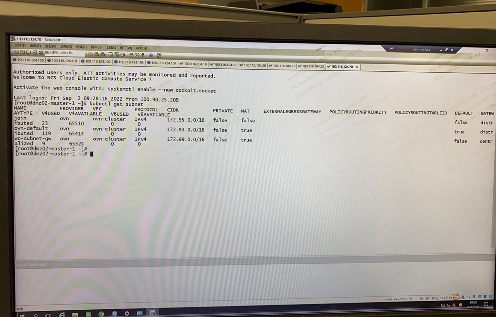
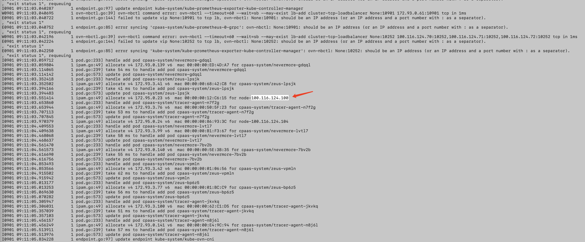
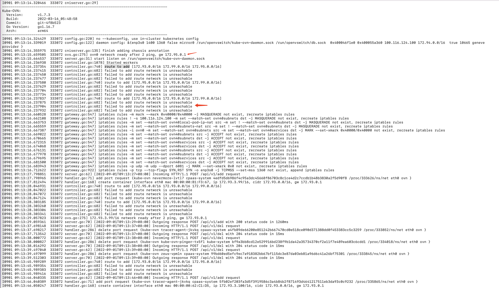

---kind:   - Troubleshootingproducts:    - Alauda Container Platform   - Alauda DevOps   - Alauda AI   - Alauda Application Services   - Alauda Service Mesh   - Alauda Developer PortalProductsVersion:   - 4.1.0,4.2.x---<!-- A type of document that involves encountering a fault, diag...it, performing root cause analysis, and providing solutions. --># 2022新加节点上的Pod无法访问 新加节点的ovn0网卡无IP地址 kube-ovn-cni配置子网路由时出现报错## Cause- 麒麟系统安全组件kylin-security-daemon可能阻止了ovn0网卡IP配置## Resolution- 关闭kylin-security-daemon安全组件- 升级kube-ovn到兼容麒麟系统的版本## [workaround]- 重启节点- 重启节点上的kube-ovn组件（如kube-ovn-controller、kube-ovn-cni）## [Related Information]**Screenshots**- Environment: 麒麟系统(arm), kube-ovn 1.7.3, ACP 3.6.2- ovn0- kube-ovn-controller- kube-ovn-cni- kylin-security-daemon- Component: Kubernetes- Page ID: 124687285- Original Title: 2022-09-01 长沙银行添加节点，访问不了节点上Pod