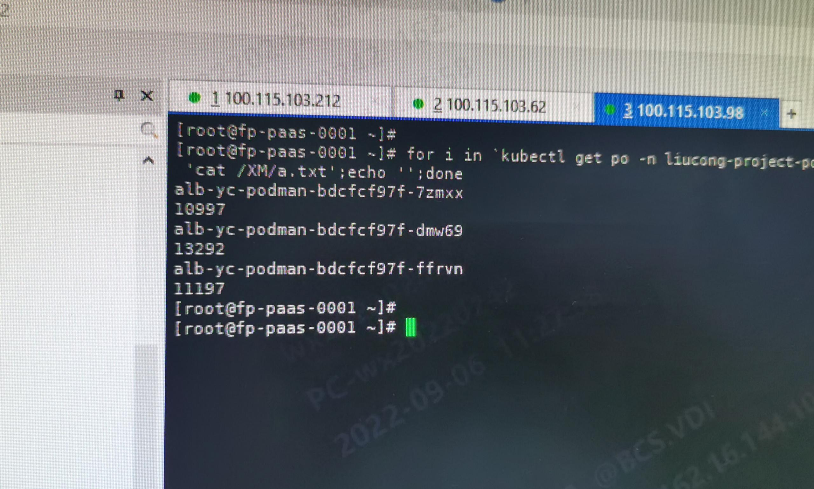
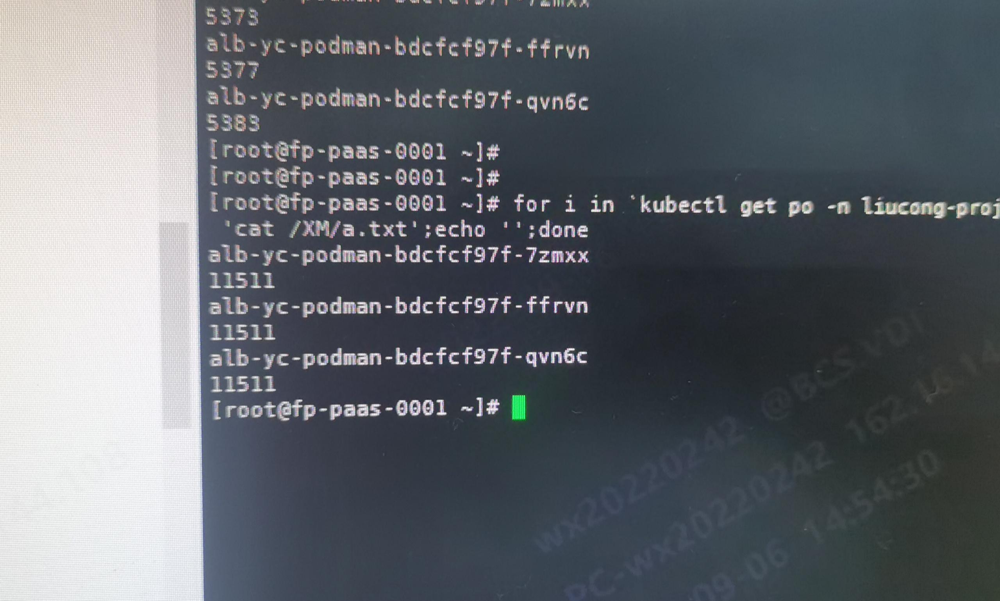

---kind:   - Troubleshootingproducts:    - Alauda Container Platform   - Alauda DevOps   - Alauda AI   - Alauda Application Services   - Alauda Service Mesh   - Alauda Developer PortalProductsVersion:   - 4.1.0,4.2.x---<!-- A type of document that involves encountering a fault, diag...it, performing root cause analysis, and providing solutions. --># acp 3.6.2 ovnk8s svc lb 轮询调度不均衡 关闭 ovn LB 后问题消失 ipvs 的负载均衡结果正常## Cause- ovn lb 基于 hash 算法实现负载均衡## Resolution- 手动关闭 ovn lb 改用 ipvs 进行负载均衡## [workaround]## [Related Information]**Screenshots**- Environment: arm架构麒麟系统/ACP 3.6.2/kube-ovn 1.7.3- ovn lb- ipvs- kube-ovn 1.7.3- k8s service- Component: Kubernetes- Page ID: 124694743- Original Title: acp 3.6.2 ovn-underlay 环境下lb负载不均衡