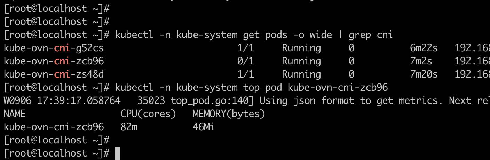

---kind:   - Troubleshootingproducts:    - Alauda Container Platform   - Alauda DevOps   - Alauda AI   - Alauda Application Services   - Alauda Service Mesh   - Alauda Developer PortalProductsVersion:   - 4.1.0,4.2.x---<!-- A type of document that involves encountering a fault, diag...it, performing root cause analysis, and providing solutions. --># acp 3.8 sddc 环境 ovn 网络不稳定ait erebus 连接外部 ip:6443 不稳定 ovn-cni readiness 检查超时 kubelet 日志中存在大量超时记录## Cause- ovn-cni readiness 检查机制问题- docker api 性能问题- ovs-ovn 组件不稳定导致频繁重启## Resolution- 升级 kubeovn 到 1.8.11 版本## [workaround]- 将 ovn-cni readiness check 改为 httpget 方式## [Related Information]**Screenshots**- Environment: ACP 3.8- 6443- ovn-cni- kubelet- docker api- ovs-ovn- kube-ovn 1.8.9- Component: kube-Ovn- Page ID: 124694752- Original Title: acp 3.8 sddc 环境 ovn 网络不稳定