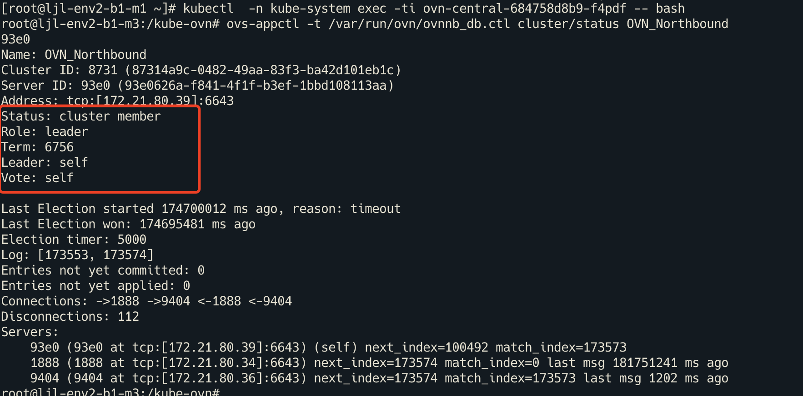
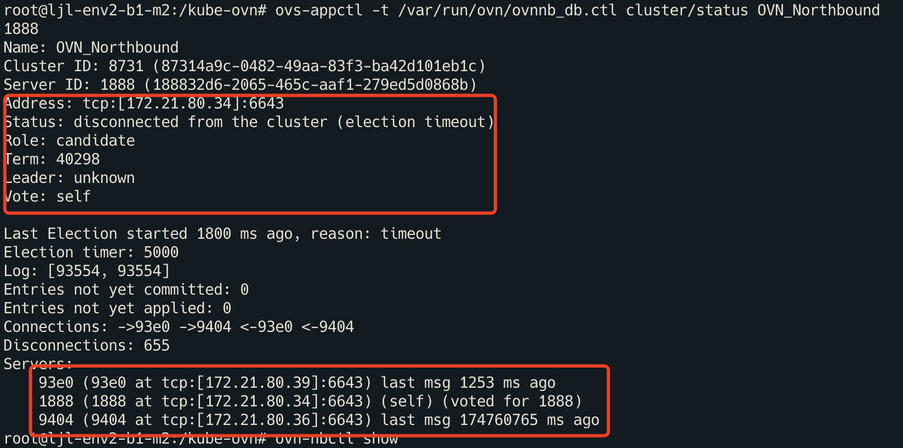

---
kind:
  - Troubleshooting
products:
  - Alauda Container Platform
  - Alauda DevOps
  - Alauda AI
  - Alauda Application Services
  - Alauda Service Mesh
  - Alauda Developer Portal
ProductsVersion:
  - 4.1.0,4.2.x
---
<!-- A type of document that involves encountering a fault, diagnosing it, performing root cause analysis, and providing solutions. -->

# kube

kube-ovn-cni 反复 crash 节点无法 ping 通 join 网关

## Cause
- ovn nb 数据库异常导致节点 join 子网 LSP 的 Claim 缺失

## Resolution
- 重建故障的 ovn-central Pod

## [workaround]

## [Related Information]
**Screenshots**

- Environment: CNI 版本：kube-ovn v1.9.8
- ovn-central Pod
- ovn nb 数据库
- LSP
- ovs-ovn
- ovn-controller
- kube-ovn-cni
- Component: kube-Ovn
- Page ID: 124695329
- Original Title: kube-ovn-cni 频繁 crash 重启
