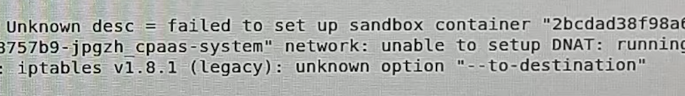
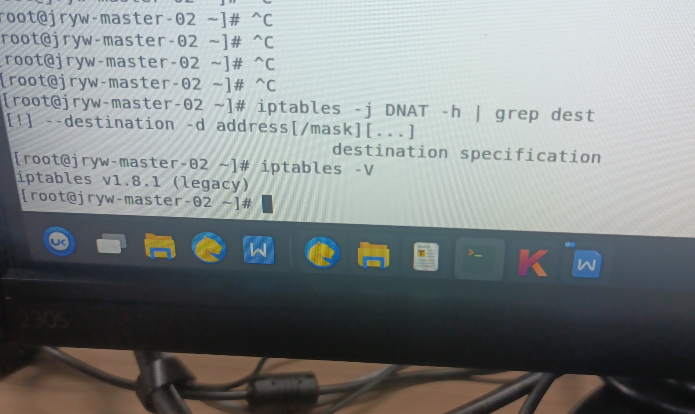
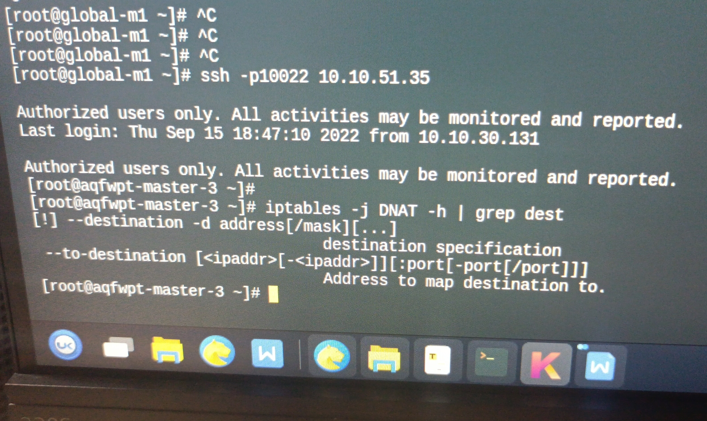
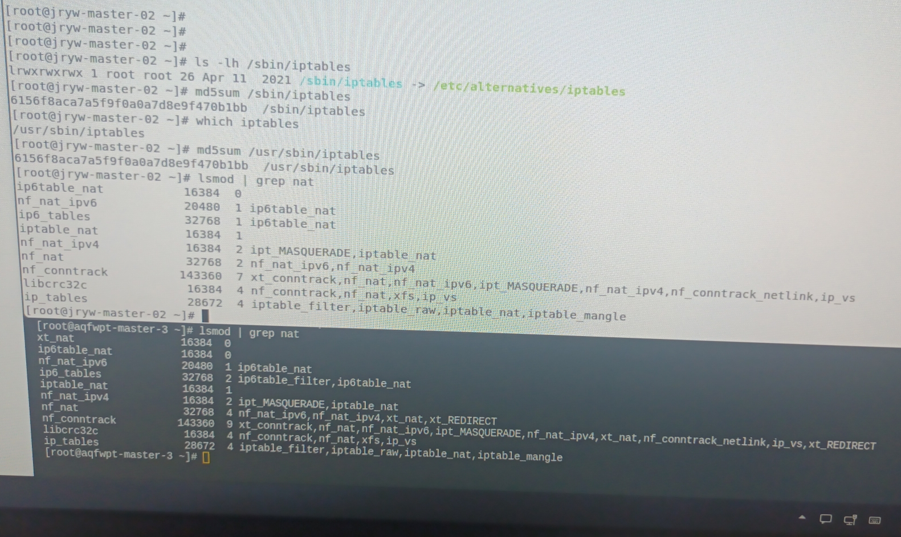
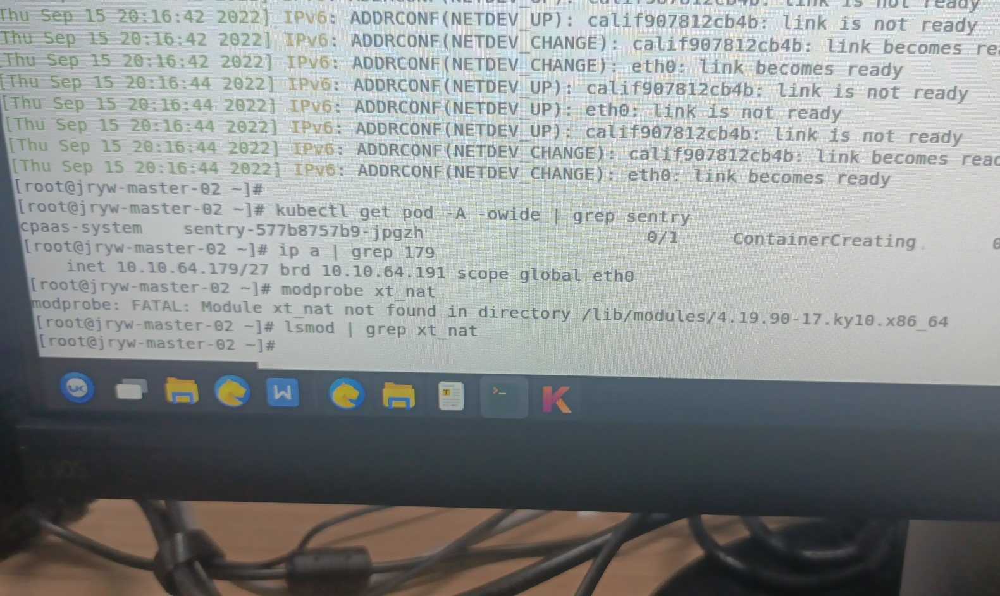

---kind:   - Troubleshootingproducts:    - Alauda Container Platform   - Alauda DevOps   - Alauda AI   - Alauda Application Services   - Alauda Service Mesh   - Alauda Developer PortalProductsVersion:   - 4.1.0,4.2.x---<!-- A type of document that involves encountering a fault, diag...it, performing root cause analysis, and providing solutions. --># iptables unknown optioniptables 报错：unknown option --to-destination 执行 iptables -j DNAT -h | grep dest 无 --to-destination 参数 故障集群未加载 xt_nat 模块## Cause- 节点升级前进行过内核升级，但未重启系统，导致缺少内核文件## Resolution## [workaround]## [Related Information]**Screenshots**- iptables- DNAT- xt_nat- lsmod- modprobe- Component: Kubernetes- Page ID: 124697508- Original Title: iptables unknown option --to-destination