---kind:   - Troubleshootingproducts:    - Alauda Container Platform   - Alauda DevOps   - Alauda AI   - Alauda Application Services   - Alauda Service Mesh   - Alauda Developer PortalProductsVersion:   - 4.1.0,4.2.x---<!-- A type of document that involves encountering a fault, diag...it, performing root cause analysis, and providing solutions. --># 2022Pod访问apiserver失败导致健康检查失败及crash重启 子网状态not ready 节点缺少容器网络路由信息## Cause- kube-ovn-controller访问apiserver超时触发leader切换- reconcileSubnet失败后未执行resetAcl更新子网状态- IPAM管理存在releaseList与freeList切换问题## Resolution- 等待leader切换完成后自动修复子网状态- 检查并修复IPAM地址分配逻辑## [workaround]## [Related Information]**Screenshots**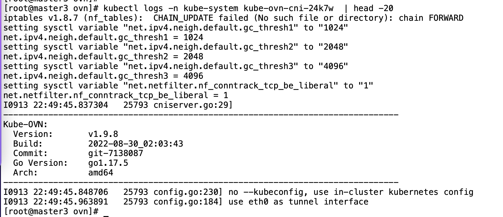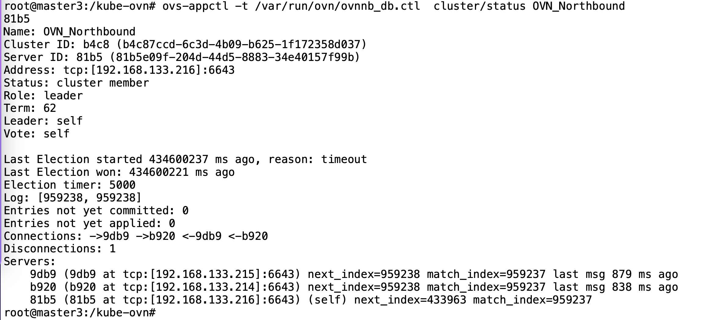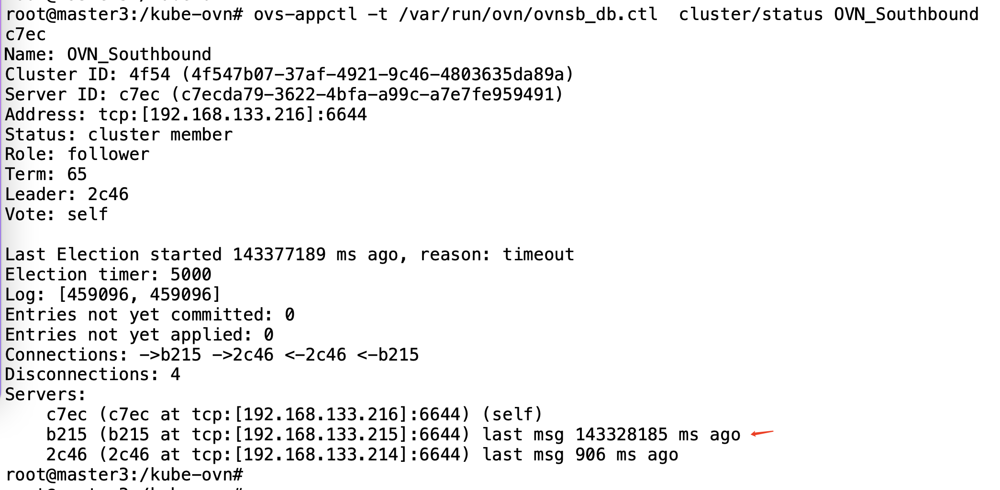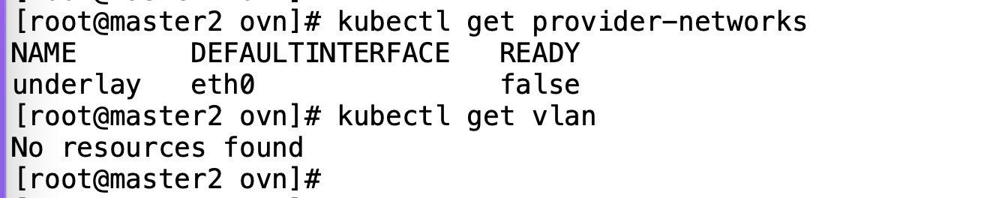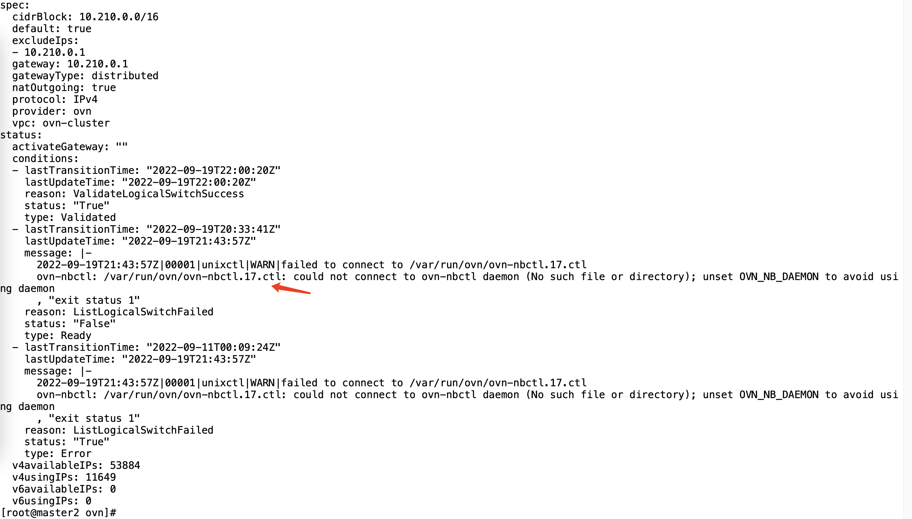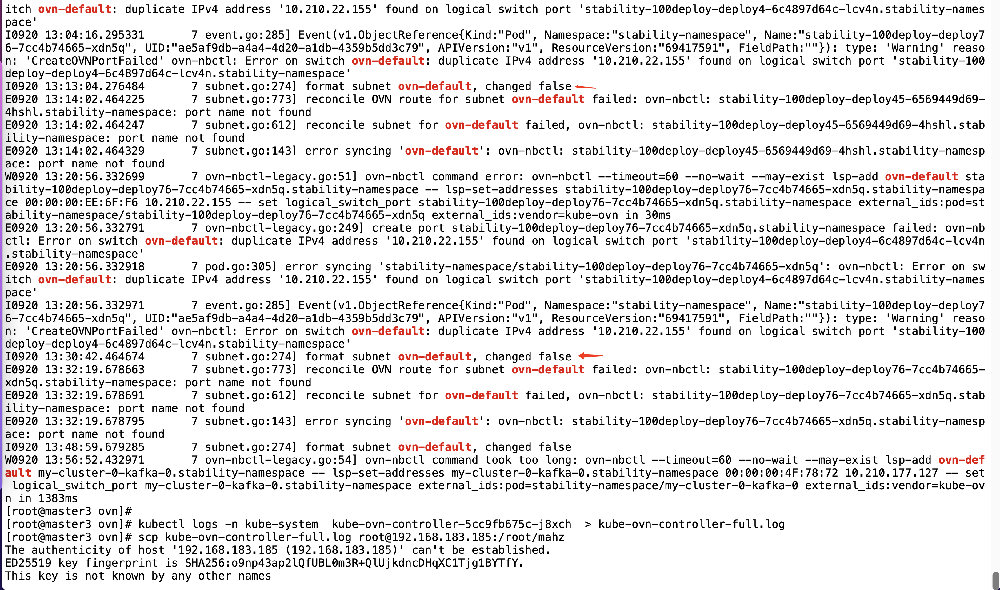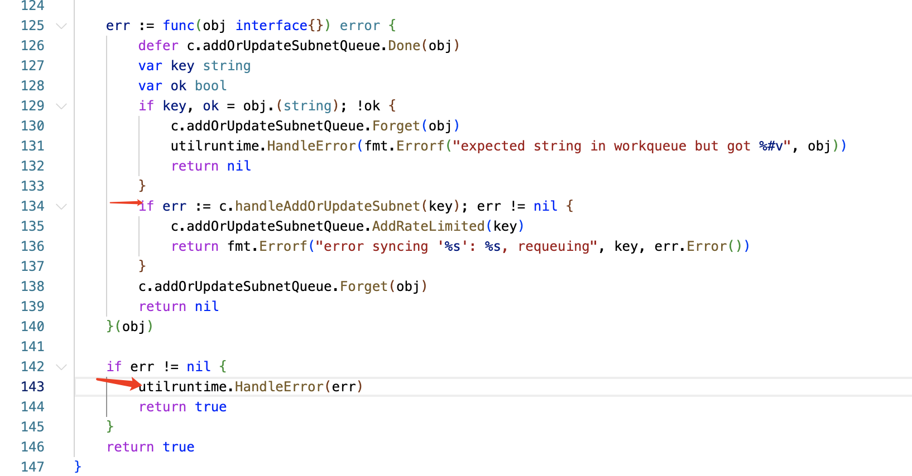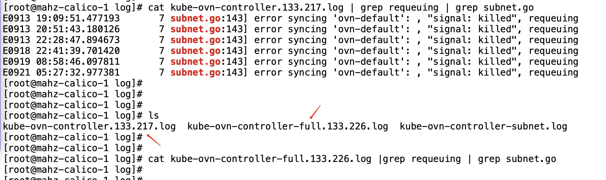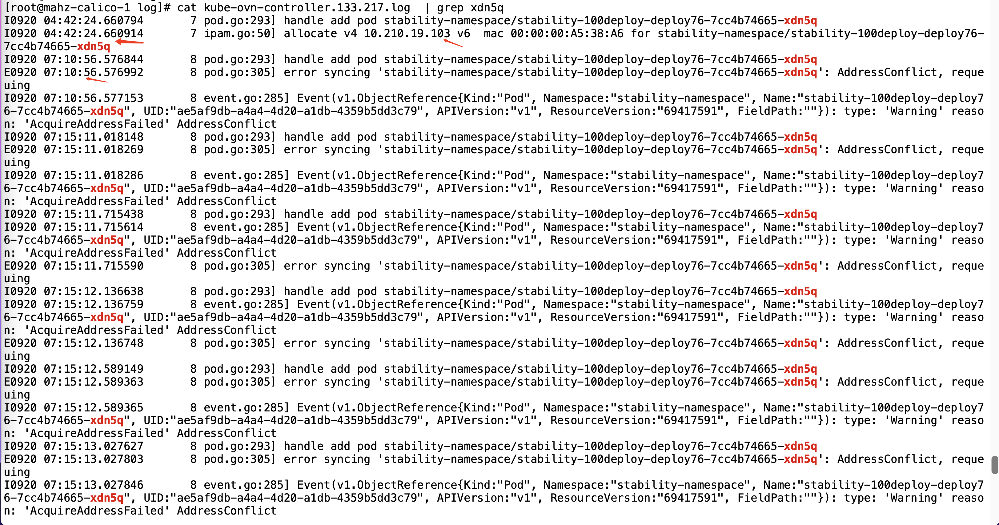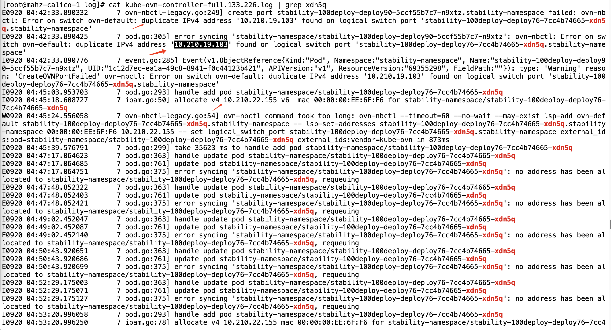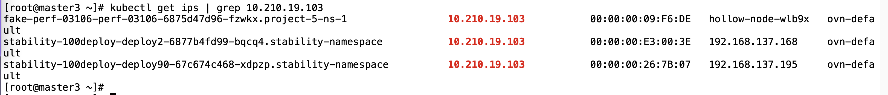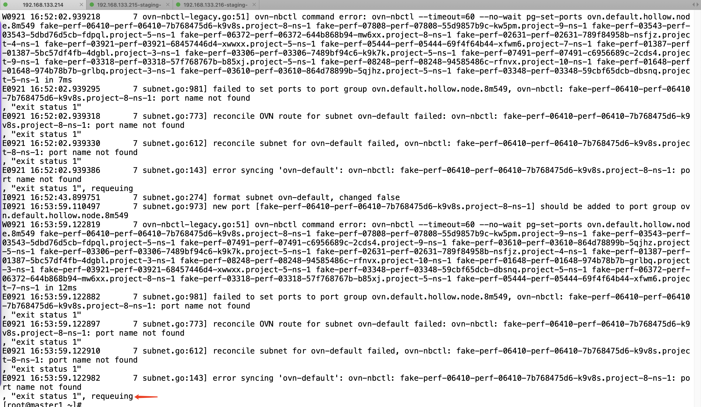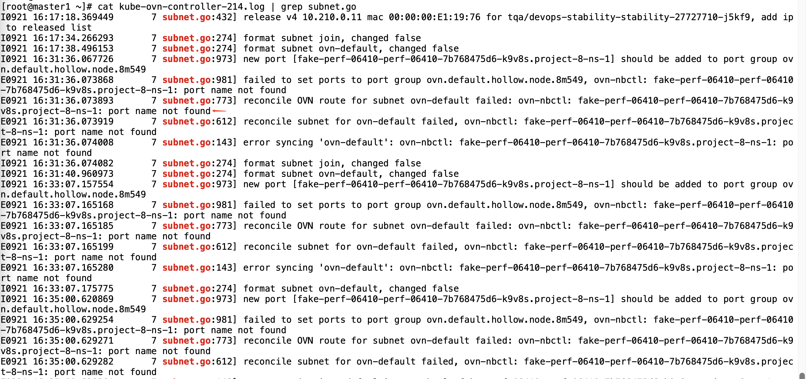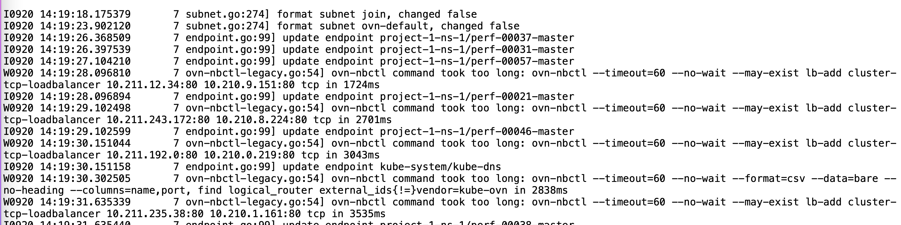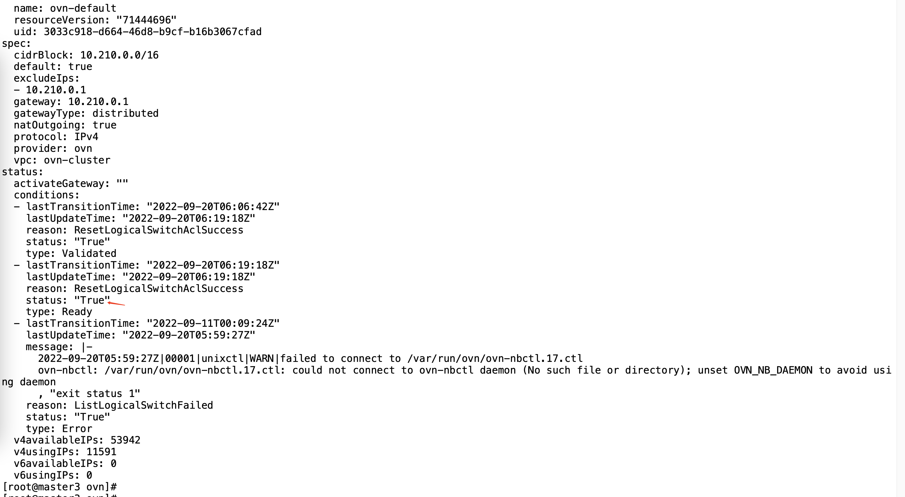- Environment: Kubernetes 1.23.8, kube-ovn v1.9.8- kube-ovn-controller- ovn-central- subnet status- apiserver- IPAM- load-balancer- Component: Kubernetes- Page ID: 124700099- Original Title: 2022-09-20 Staging 环境，svc 访问不了问题