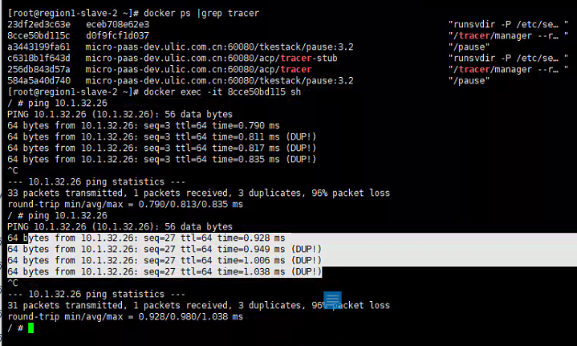

---
kind:
  - Troubleshooting
products:
  - Alauda Container Platform
  - Alauda DevOps
  - Alauda AI
  - Alauda Application Services
  - Alauda Service Mesh
  - Alauda Developer Portal
ProductsVersion:
  - 4.1.0,4.2.x
---
<!-- A type of document that involves encountering a fault, diagnosing it, performing root cause analysis, and providing solutions. -->

# Underlay 跨节点 Pod 之间无法正常通信

跨节点 Pod 之间连接超时，ICMP 卡顿或出现 DUP 包 节点直接访问 Pod 正常，仅特定两个节点间 Pod 通信异常 ovs-dpctl 流表中存在 actions:drop 的异常流表

## Cause
- VMWare 反向路径检查导致重复数据包从 ens224 进入 OVS Datapath
- 异常流量触发 OVS 流表错误导致丢包

## Resolution
- 在 VMWare 主机设置 Net.ReversePathFwdCheckPromisc=1

## [workaround]
- 手动将 bond1 的其中一个网卡设置为 down
- 将虚拟机分散调度到不同 VMWare 主机

## [Related Information]
**Screenshots**

- Environment: ovn underlay
- ovs-dpctl dump-flows
- br-provider
- ens224
- fdb 表
- Net.ReversePathFwdCheckPromisc
- Component: kube-Ovn
- Page ID: 127426873
- Original Title: Underlay 跨节点 Pod 之间无法正常通信
