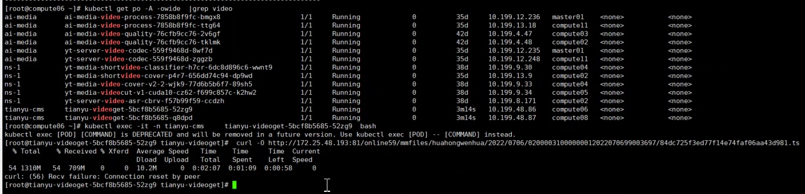
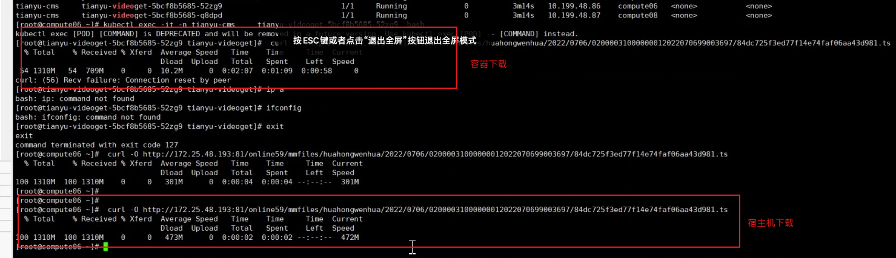

---
kind:
  - Troubleshooting
products:
  - Alauda Container Platform
  - Alauda DevOps
  - Alauda AI
  - Alauda Application Services
  - Alauda Service Mesh
  - Alauda Developer Portal
ProductsVersion:
  - 4.1.0,4.2.x
---
<!-- A type of document that involves encountering a fault, diagnosing it, performing root cause analysis, and providing solutions. -->

# curl 下载集群外大文件时中断

Pod中下载大文件时出现connection reset by peer错误 宿主机下载相同文件正常 容器限速10m/s后下载正常

## Cause
- SNAT阶段处理异常导致RST包问题
- conntrack将out of window包标记为INVALID状态
- 未开启nf_conntrack_tcp_be_liberal参数导致NAT转换问题

## Resolution
- 设置nf_conntrack_tcp_be_liberal参数：echo 1 > /proc/sys/net/netfilter/nf_conntrack_tcp_be_liberal
- 永久配置：在/etc/sysctl.conf添加net.netfilter.nf_conntrack_tcp_be_liberal=1并执行sysctl -p

## [workaround]
- 通过iptables规则和路由配置绕过SNAT转换
- 直接暴露Pod到外部网络

## [Related Information]
**Screenshots**

- Environment: ovn overlay
- iptables
- nf_conntrack_tcp_be_liberal
- OVS
- conntrack
- sysctl.conf
- /proc/sys/net/netfilter/nf_conntrack_tcp_be_liberal
- Component: kube-Ovn
- Page ID: 127426922
- Original Title: curl 下载集群外大文件时中断 - connection reset by peer
