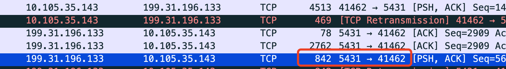
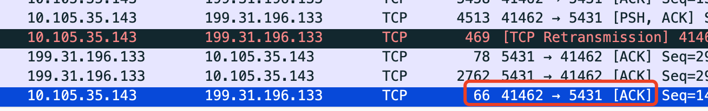
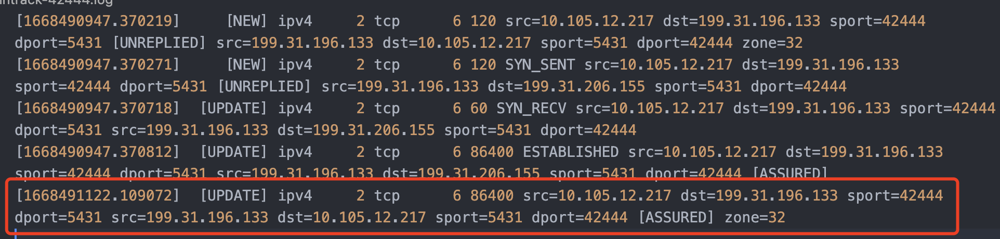

---kind:   - Troubleshootingproducts:    - Alauda Container Platform   - Alauda DevOps   - Alauda AI   - Alauda Application Services   - Alauda Service Mesh   - Alauda Developer PortalProductsVersion:   - 4.1.0,4.2.x---<!-- A type of document that involves encountering a fault, diag...it, performing root cause analysis, and providing solutions. --># 应用访问集群外数据库线程挂起JAVA应用通过子网SNAT访问集群外数据库出现线程挂起 堆栈显示在java.net.SocketInputStream.socketRead0处挂起 主机与数据库间防火墙禁止长链接## Cause- OVS调用conntrack异常导致网络包被丢包- 客户端未设置TCP_USER_TIMEOUT参数- kube-ovn-controller处理NetworkPolicy更新时存在空窗期导致流量被drop## Resolution- 设置socket超时参数（如TCP_USER_TIMEOUT）- 升级Kube-OVN版本并调整数据流链路绕过conntrack- 应用<https://github.com/kubeovn/kube-ovn/pull/2677>修复kube-ovn-controller更新逻辑## [workaround]- 修改Pod为主机网络模式- 调整sysctl参数：net.ipv4.tcp_fin_timeout=15## [Related Information]**Screenshots**- OVS- conntrack- Kube-OVN- NetworkPolicy- TCP_USER_TIMEOUT- sysctl参数：net.netfilter.nf_conntrack_tcp_timeout_close/net.ipv4.tcp_timestamps- zone=8- Component: Kubernetes- Page ID: 127429757- Original Title: 应用访问集群外数据库线程挂起