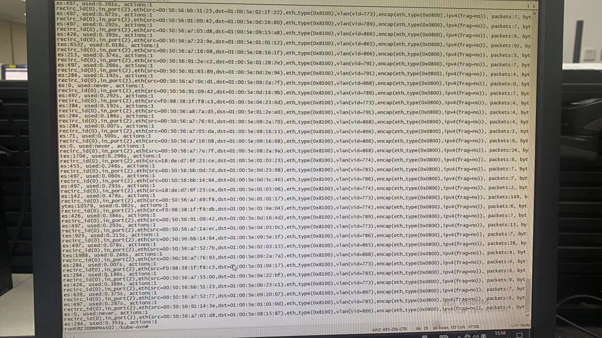
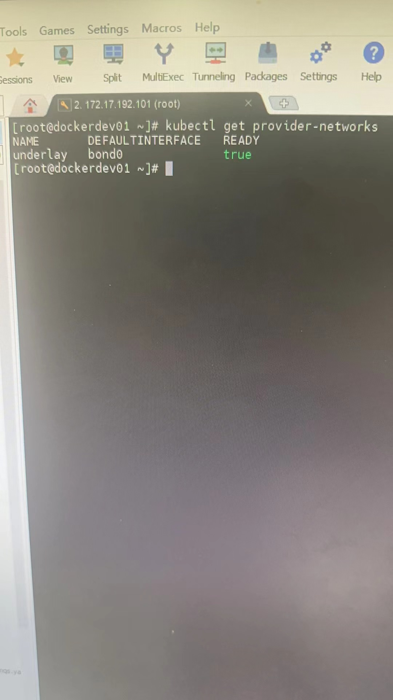
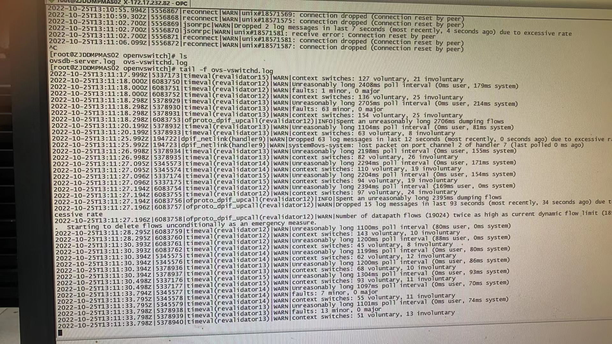

---kind:   - Troubleshootingproducts:    - Alauda Container Platform   - Alauda DevOps   - Alauda AI   - Alauda Application Services   - Alauda Service Mesh   - Alauda Developer PortalProductsVersion:   - 4.1.0,4.2.x---<!-- A type of document that involves encountering a fault, diag...it, performing root cause analysis, and providing solutions. --># ovspod 之间的时延不稳定 ovs-ovn CPU 利用率持续 100%## Cause- 大量不属于当前节点的 underlay 网络数据包进入 ovs 网桥- 底层交换机开启混杂模式导致异常流量## Resolution- kubectl get provider-networks underlay -o yaml >/tmp/provider-networks.yaml- kubectl delete provider-networks underlay## [workaround]## [Related Information]**Screenshots**- Environment: CNI 1.8.5, overlay 部署- ovs-ovn- ovn-controller- provider-network- ovs-dpctl- kube-ovn- networkpolicy- Component: Kubernetes- Page ID: 127432454- Original Title: ovs-ovn CPU 使用率 100%