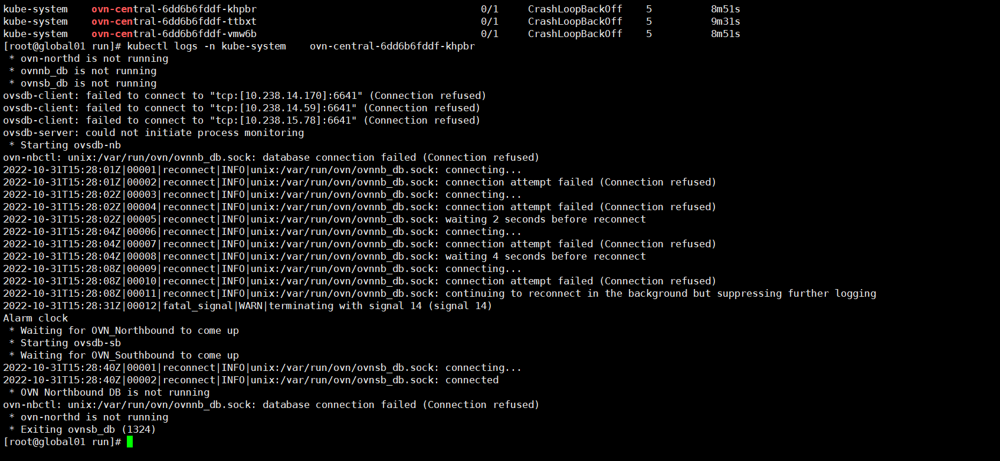
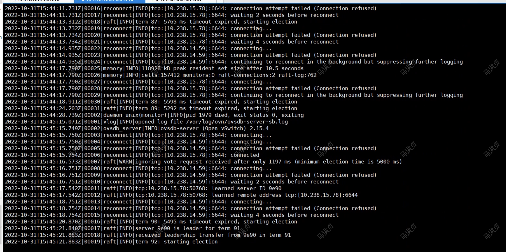
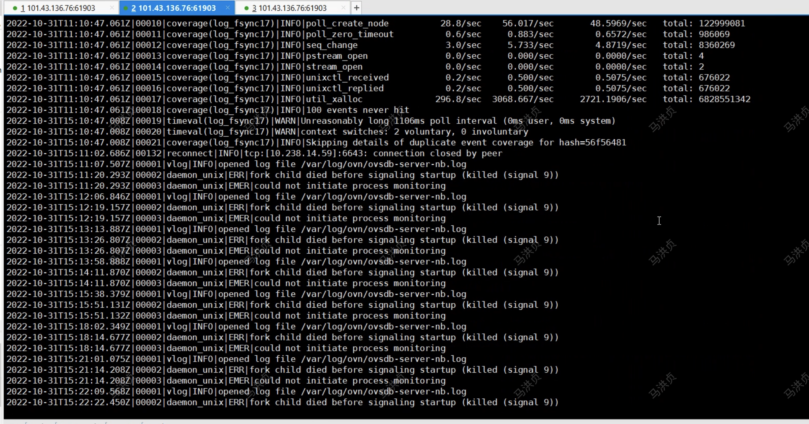

---kind:   - Troubleshootingproducts:    - Alauda Container Platform   - Alauda DevOps   - Alauda AI   - Alauda Application Services   - Alauda Service Mesh   - Alauda Developer PortalProductsVersion:   - 4.1.0,4.2.x---<!-- A type of document that involves encountering a fault, diag...it, performing root cause analysis, and providing solutions. --># 2022ovn-central pod 无法启动 生产环境升级后出现异常，测试环境正常 数据库异常日志记录## Cause- 升级过程中旧数据库文件导致兼容性问题- 之前生产环境数据库遗留问题影响## Resolution- 删除所有数据库文件- 重新恢复数据库## [workaround]## [Related Information]**Screenshots**- Environment: kube-ovn v1.8.6- ovn-central- /var/log/ovn- kube-ovn- Component: kube-ovn- Page ID: 130548572- Original Title: 2022-10-31  CCTV生产环境升级，kube-ovn db 异常