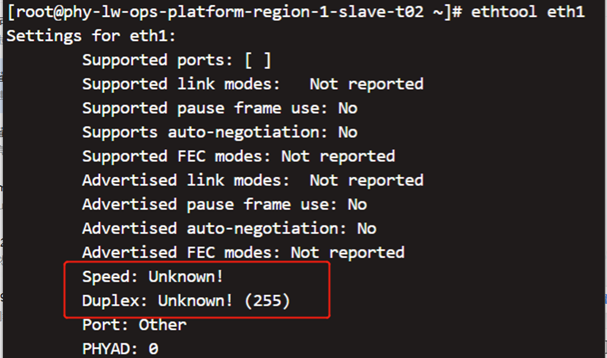
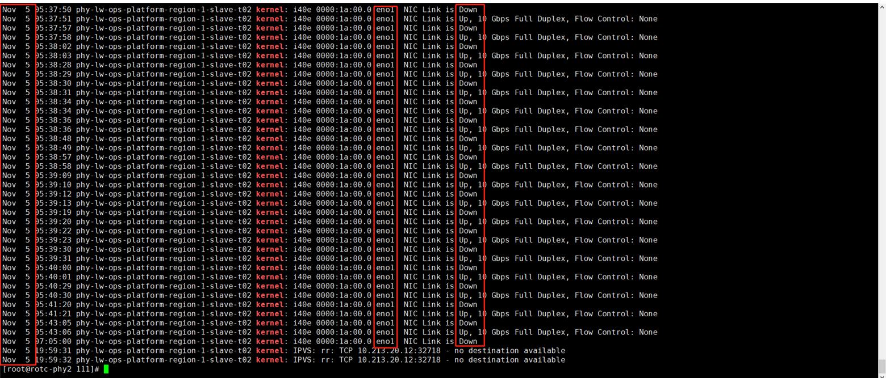

---
kind:
  - Troubleshooting
products:
  - Alauda Container Platform
  - Alauda DevOps
  - Alauda AI
  - Alauda Application Services
  - Alauda Service Mesh
  - Alauda Developer Portal
ProductsVersion:
  - 4.1.0,4.2.x
---
<!-- A type of document that involves encountering a fault, diagnosing it, performing root cause analysis, and providing solutions. -->

# 3.10

coredns、pinger容器无法启动 Failed to create pod sandbox: rpc error: code = Unknown desc = failed to set up sandbox container resolve MAC address of 10.213.159.254 timeout: i/o timeout

## Cause
- master2节点eth1端口与其他物理机eth1端口不在同一vlan
- ethtool eth1显示speed duplex处于unknown状态
- 网线虚接导致NIC链路频繁up/down

## Resolution
- 检查交换机vlan和端口绑定配置
- 重启主机恢复网卡speed duplex状态
- 检查并加固物理网线连接

## [workaround]
- 将coredns容器驱逐到其他正常节点运行

## [Related Information]
**Screenshots**

- Environment: ACP 3.10 ovn underlay网络
- eth1
- vlan 3500
- coredns
- pinger
- kube-proxy
- CNI插件
- Component: kube-Ovn
- Page ID: 130552655
- Original Title: 3.10-ovn故障-coredns容器无法启动
