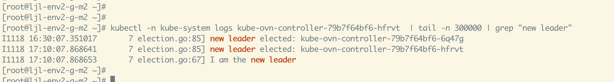
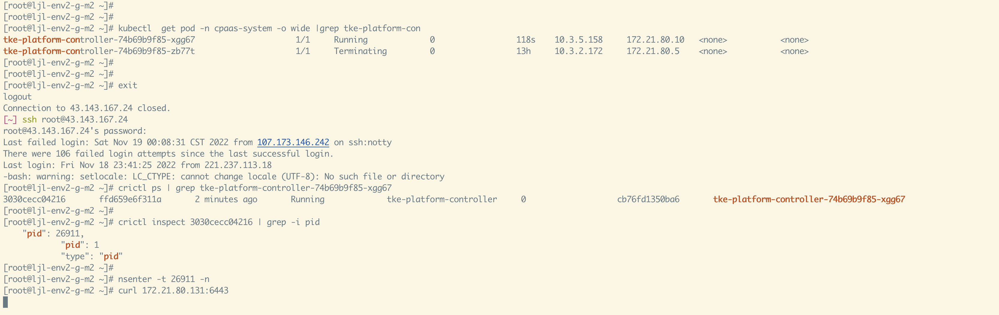
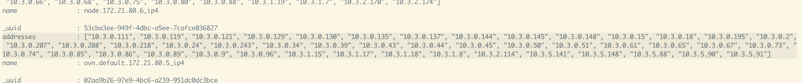
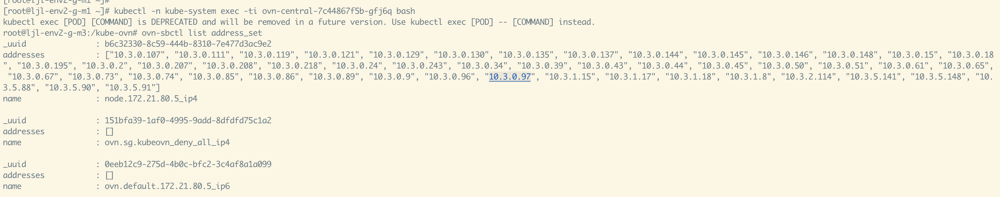
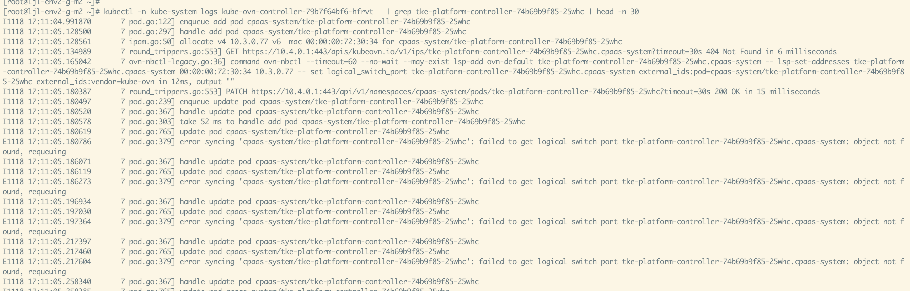
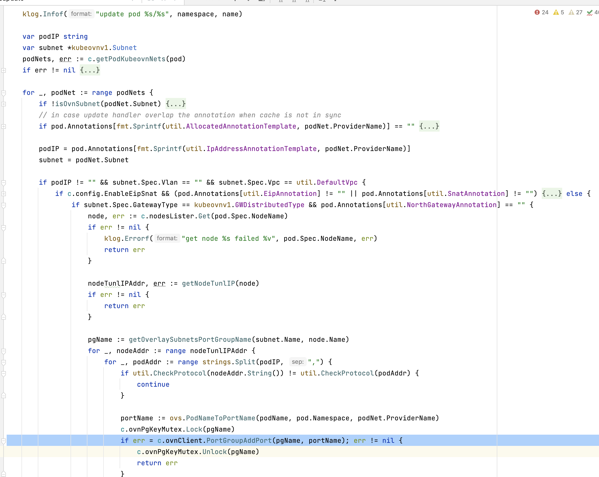

---kind:   - Troubleshootingproducts:    - Alauda Container Platform   - Alauda DevOps   - Alauda AI   - Alauda Application Services   - Alauda Service Mesh   - Alauda Developer PortalProductsVersion:   - 4.1.0,4.2.x---<!-- A type of document that involves encountering a fault, diag...it, performing root cause analysis, and providing solutions. --># nb leader 所在节点断电后的 libovsdb list lsp失效新建 Pod 处于 Running 状态但无法访问外网 ovn-default port group 未包含新创建 Pod 的地址## Cause- nb leader 所在节点断电导致 libovsdb 的 list lsp 功能失效- controller 的 handleUpdate 逻辑在错误处理时直接返回未重试## Resolution- 通过日志记录更多信息进行 debug 处理（第三方库限制）## [workaround]## [Related Information]**Screenshots**- Environment: CNI 1.9.14- libovsdb- ovn-default port group- controller handleUpdate 逻辑- nb leader pod- Component: Kubernetes- Page ID: 130564267- Original Title: nb leader 所在节点断电后的 libovsdb list lsp失效