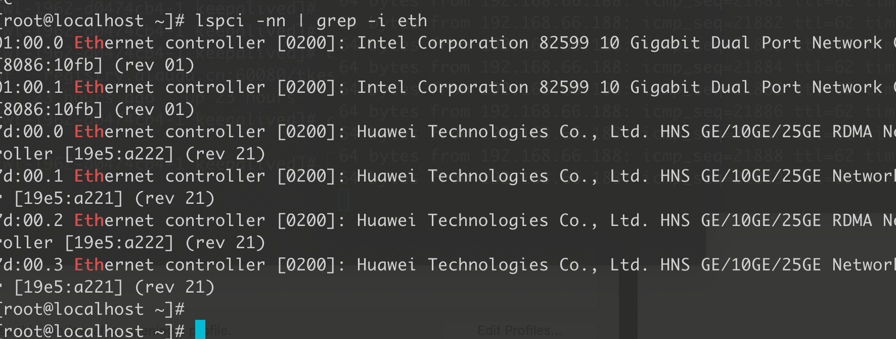
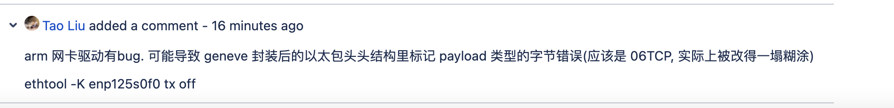

---kind:   - Troubleshootingproducts:    - Alauda Container Platform   - Alauda DevOps   - Alauda AI   - Alauda Application Services   - Alauda Service Mesh   - Alauda Developer PortalProductsVersion:   - 4.1.0,4.2.x---<!-- A type of document that involves encountering a fault, diag...it, performing root cause analysis, and providing solutions. --># 物理机 curl 不稳定时通时不通特定物理机 node 上的 pod 访问 apiservr 时不稳定 容器内 eth0 与 master ovn0 抓包数据对不上 容器内大量 ACK 重传，主机未收到## Cause- 网卡导致 geneve 封装数据包头被修改- 华为 HNS 网卡驱动或配置问题## Resolution- 升级网卡驱动- ethtool -K eth0 tx off## [workaround]- ethtool 关闭发送端 checksum offload: ethtool -K eth0 tx off## [Related Information]**Screenshots**ethtool -K eth0 tx off           - Environment: arm, CNI 1.9, 华为 HNS 网卡- geneve- eth0- ovnS 网卡- ethtool 配置- Component: Kubernetes- Page ID: 133077570- Original Title: 物理机 curl 不稳定时通时不通