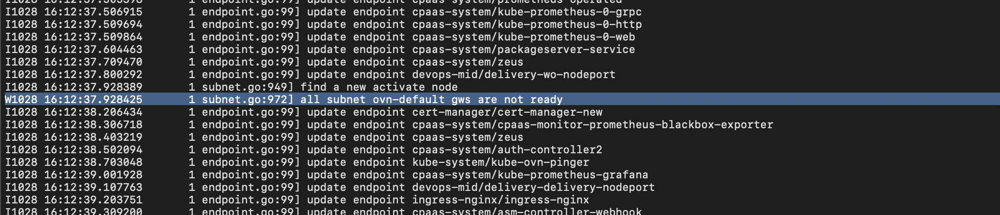
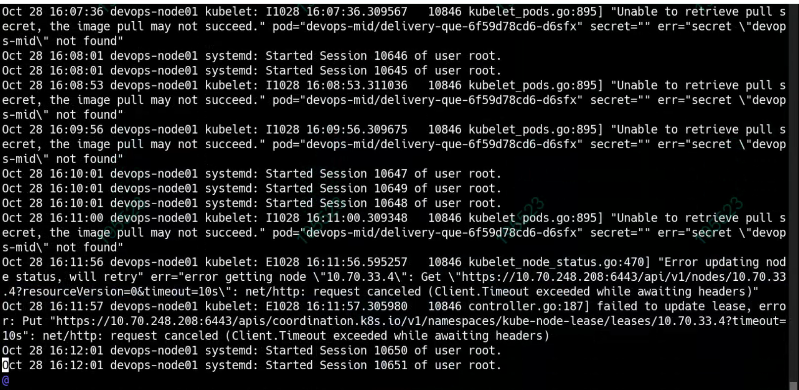

---
kind:
  - Troubleshooting
products:
  - Alauda Container Platform
  - Alauda DevOps
  - Alauda AI
  - Alauda Application Services
  - Alauda Service Mesh
  - Alauda Developer Portal
ProductsVersion:
  - 4.1.0,4.2.x
---
<!-- A type of document that involves encountering a fault, diagnosing it, performing root cause analysis, and providing solutions. -->

# kube

coredns and pinger in crash state dial tcp 10.96.0.1:443: i/o timeout in logs node cannot ping container IP and server IP

## Cause
- OVN 1.8.5 bug: subnet enters notready mode when all gateways are temporarily unreachable, causing deletion of pod CIDR routes
- kubelet reported status timeout to apiserver leading to node notready state

## Resolution
- Upgrade to OVN 1.8.11 version
- Check kubelet connection to apiserver

## [workaround]
- Restart all OVN components

## [Related Information]
**Screenshots**

- Environment: TKE 3.4.2, OVN 1.8.5
- coredns
- pinger
- kube-ovn
- 10.96.0.1:443
- subnet
- ovn0
- /var/log/kube-ovn/ovn.log
- kubelet logs
- Component: kube-ovn
- Page ID: 133082028
- Original Title: kube-ovn网络出现问题
