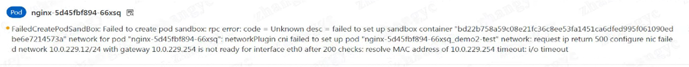
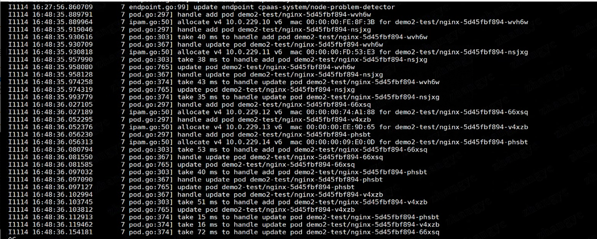
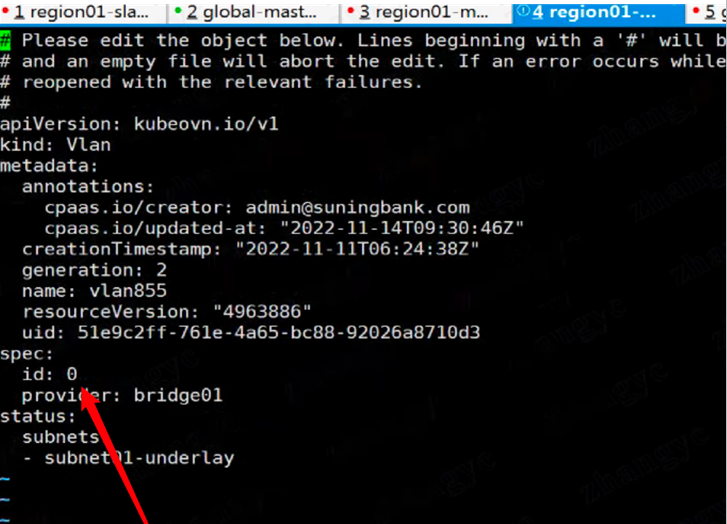

---
kind:
  - Troubleshooting
products:
  - Alauda Container Platform
  - Alauda DevOps
  - Alauda AI
  - Alauda Application Services
  - Alauda Service Mesh
  - Alauda Developer Portal
ProductsVersion:
  - 4.1.0,4.2.x
---
<!-- A type of document that involves encountering a fault, diagnosing it, performing root cause analysis, and providing solutions. -->

# ovn集群使用新建underlay子网创建pod失败

使用新建underlay子网创建pod时拿不到ip

## Cause
- underlay子网配置中vlanid被设置为非0值

## Resolution
- 将单网卡underlay子网的vlanid配置为0

## [workaround]

## [Related Information]
**Screenshots**

- Environment: overlay集群
- underlay子网
- vlanid配置
- ovn-controller日志
- ip l add命令
- Component: kube-Ovn
- Page ID: 133083139
- Original Title: ovn集群使用新建underlay子网创建pod失败
