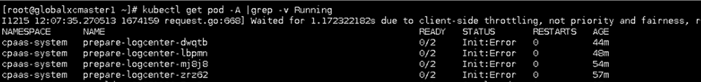

---
kind:
  - Troubleshooting
products:
  - Alauda Container Platform
  - Alauda DevOps
  - Alauda AI
  - Alauda Application Services
  - Alauda Service Mesh
  - Alauda Developer Portal
ProductsVersion:
  - 4.1.0,4.2.x
---
<!-- A type of document that involves encountering a fault, diagnosing it, performing root cause analysis, and providing solutions. -->

# 日志存储组件部署失败

日志存储组件部署失败 无deploy资源生成 网络请求kube-apiserver超时

## Cause
- 主机网卡驱动参数配置问题
- tx offload协议未正确配置

## Resolution
- 执行命令：ethtool -K ETH tx off（ETH为物理网卡名称）
- 验证配置：ethtool -k 网课名称 | grep tx

## [workaround]

## [Related Information]
**Screenshots**

- Environment: 麒麟v10操作系统
- kube-apiserver
- ovn服务
- 物理网卡配置
- ethtool配置参数
- Component: kube-Ovn
- Page ID: 133088238
- Original Title: 日志存储组件部署失败-无deploy资源生成-网卡驱动引起的网络问题导致
