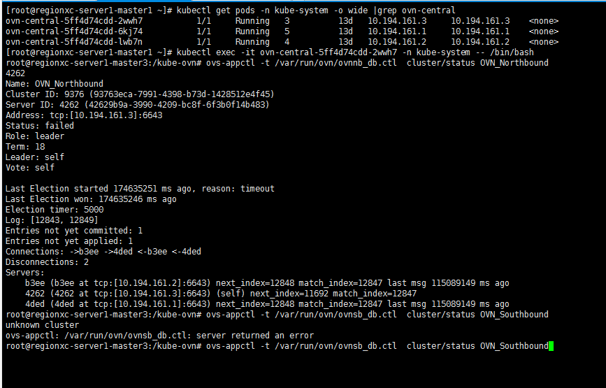

---
kind:
  - Troubleshooting
products:
  - Alauda Container Platform
  - Alauda DevOps
  - Alauda AI
  - Alauda Application Services
  - Alauda Service Mesh
  - Alauda Developer Portal
ProductsVersion:
  - 4.1.0,4.2.x
---
<!-- A type of document that involves encountering a fault, diagnosing it, performing root cause analysis, and providing solutions. -->

# 3.8.1

pod事件报错/run/openvswitch/kube-ovn-daemon.sock: connect: no such file or directory nb数据库出现多主现象 sb数据库显示节点异常

## Cause
- 计算节点重启导致ovn数据库集群出现多主状态

## Resolution
- 检查ovn-central pod的数据库集群状态：ovs-appctl -t /var/run/ovn/ovnnb_db.ctl cluster/status OVN_Northbound 和 ovs-appctl -t /var/run/ovn/ovnsb_db.ctl cluster/status OVN_Southbound
- 剔除异常的nb master节点
- 删除失效的数据库集群ID（如b3ee）
- 重启相关服务使集群恢复正常

## [workaround]

## [Related Information]
**Screenshots**

2、进到nb master对应的ovn-central pod内，执行ovs-appctl -t /var/run/ovn/ovnnb\_db.ctl cluster/status OVN\_Northbound和ovs-appctl -t /var/run/ovn/ovnsb\_db.ctl cluster/status OVN\_Southbound，161.3节点nb正常，剔除161.2这个 nb master

- Environment: 3.8.1
- /run/openvswitch/kube-ovn-daemon.sock
- ovn-central pod
- OVN_Northbound
- OVN_Southbound
- /var/run/ovn/ovnnb_db.ctl
- /var/run/ovn/ovnsb_db.ctl
- Component: kube-Ovn
- Page ID: 133091952
- Original Title: 3.8.1-容器平台-计算节点上pod无法正常运行
