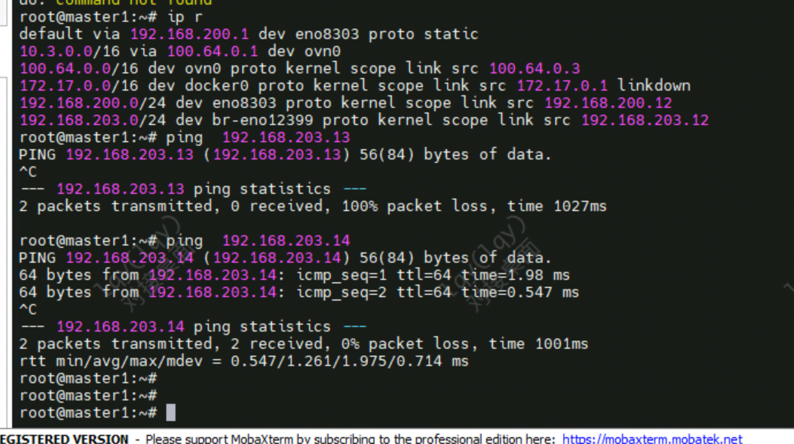

---kind:   - Troubleshootingproducts:    - Alauda Container Platform   - Alauda DevOps   - Alauda AI   - Alauda Application Services   - Alauda Service Mesh   - Alauda Developer PortalProductsVersion:   - 4.1.0,4.2.x---<!-- A type of document that involves encountering a fault, diag...it, performing root cause analysis, and providing solutions. --># 特微跨节点pod访问不通（200.13节点无法访问其他节点pod） kube-ovn-cni日志显示网卡相关异常 节点间通过管理网卡eno0800通信正常## Cause- Iaas层对eno12399网卡存在配置问题- overlay网络错误使用underlay网卡eno12399导致跨节点通信失败## Resolution- 临时将overlay通信网卡切换为管理网卡eno0800- 待Iaas层修复eno12399网卡配置后恢复## [workaround]## [Related Information]**Screenshots**- Environment: Kubernetes(kube-ovn v1.9.13), ACP 3.10- kube-ovn- eno12399- eno0800- overlay/underlay网络配置- 200.12/200.13/200.14节点IP- Component: Kubernetes- Page ID: 136517129- Original Title: 特微-跨节点pod 访问不通，确认为Iaas 配置问题