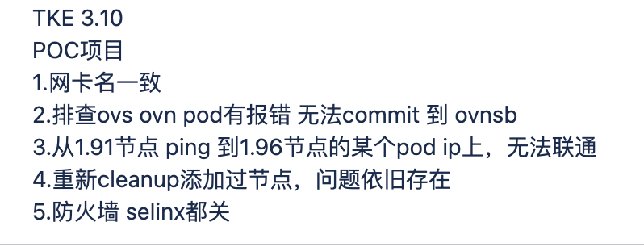
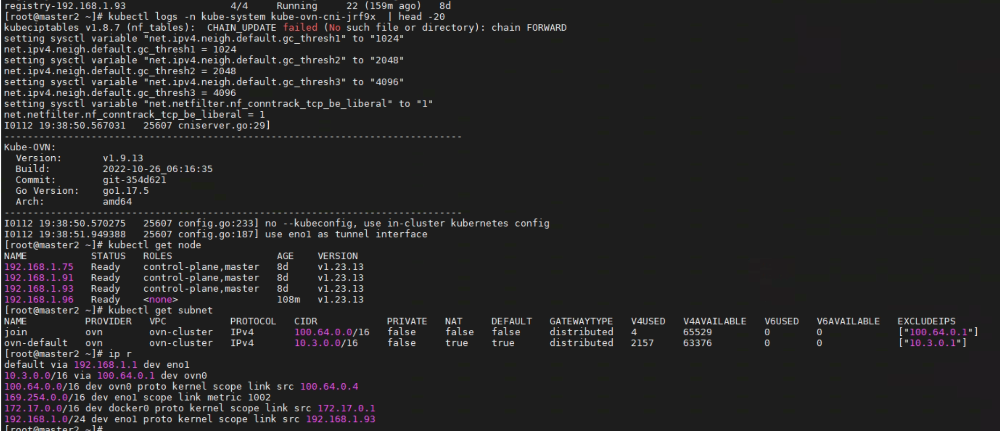
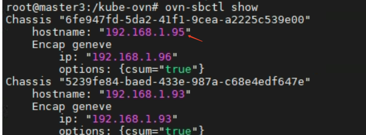

---kind:   - Troubleshootingproducts:    - Alauda Container Platform   - Alauda DevOps   - Alauda AI   - Alauda Application Services   - Alauda Service Mesh   - Alauda Developer PortalProductsVersion:   - 4.1.0,4.2.x---<!-- A type of document that involves encountering a fault, diag...it, performing root cause analysis, and providing solutions. --># 高寻真源新加节点上的pod访问不通 节点状态显示unknown## Cause- IP地址冲突（1.95改为1.96）导致chassis信息不一致## Resolution- 删除冲突节点的chassis记录- 重建ovs-ovn和kube-ovn-cni pod- 重建其他节点ovs-ovn组件## [workaround]## [Related Information]**Screenshots**- Environment: CNI: ACP 3.10, kube-ovn v1.9.13- ovs-ovn- kube-ovn-cni- chassis- IP地址配置- Component: Kubernetes- Page ID: 136517154- Original Title: 高寻真源-新加节点网络不通