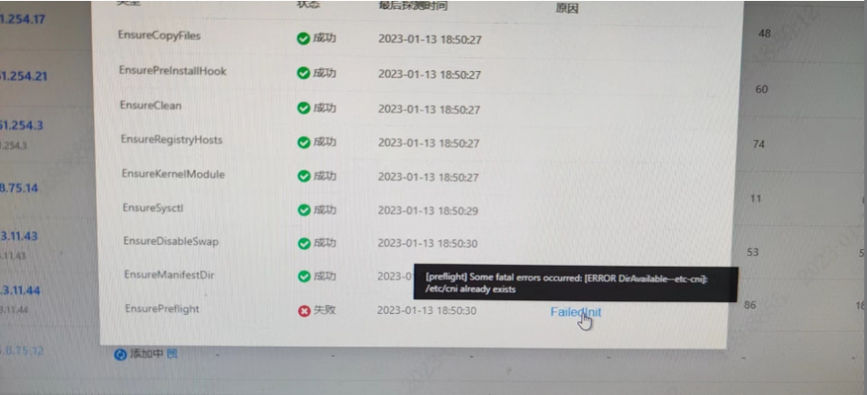

---
kind:
  - Troubleshooting
products:
  - Alauda Container Platform
  - Alauda DevOps
  - Alauda AI
  - Alauda Application Services
  - Alauda Service Mesh
  - Alauda Developer Portal
ProductsVersion:
  - 4.1.0,4.2.x
---
<!-- A type of document that involves encountering a fault, diagnosing it, performing root cause analysis, and providing solutions. -->

# 3.4.2

添加节点失败，提示/etc/cni已存在 手动删除/etc/cni后界面未继续执行 再次清理并重新加入仍报错

## Cause
- 节点残留/etc/cni目录导致冲突

## Resolution
- 重新手动删除/etc/cni目录
- 在添加节点界面继续操作

## [workaround]

## [Related Information]
**Screenshots**

- Environment: ACP 3.4.2
- /etc/cni
- cleanup.sh
- ovn网络
- Component: kube-Ovn
- Page ID: 136524034
- Original Title: 3.4.2-添加节点失败，提示/etc/cni已存在
