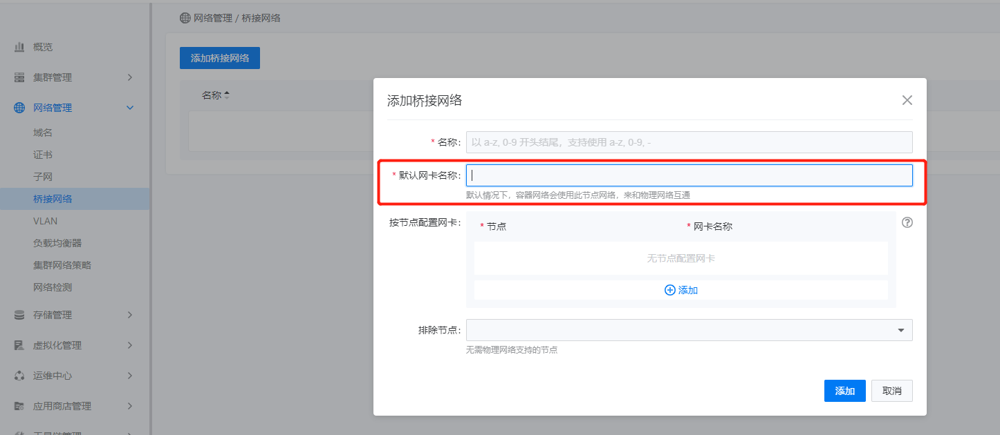
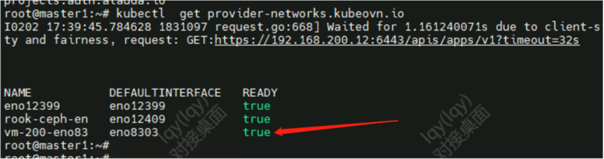

---
kind:
  - Troubleshooting
products:
  - Alauda Container Platform
  - Alauda DevOps
  - Alauda AI
  - Alauda Application Services
  - Alauda Service Mesh
  - Alauda Developer Portal
ProductsVersion:
  - 4.1.0,4.2.x
---
<!-- A type of document that involves encountering a fault, diagnosing it, performing root cause analysis, and providing solutions. -->

# 3.10.1

业务集群不可用

## Cause
- 将SSH网卡错误地配置为网桥

## Resolution
- 删除新增的网桥

## [workaround]

## [Related Information]
**Screenshots**

- Environment: 3.10.1
- ovn underlay
- 网桥
- SSH网卡
- Component: kube-Ovn
- Page ID: 136527986
- Original Title: 3.10.1-OVN-underlay-误把ssh的网卡建成网桥导致业务集群不可用
