---
kind:
  - Troubleshooting
products:
  - Alauda Container Platform
  - Alauda DevOps
  - Alauda AI
  - Alauda Application Services
  - Alauda Service Mesh
  - Alauda Developer Portal
ProductsVersion:
  - 4.1.0,4.2.x
---
<!-- A type of document that involves encountering a fault, diagnosing it, performing root cause analysis, and providing solutions. -->

# egress acl options增加 apply

z/a, b, c 到 x/a 偶发不通 conntrack 状态显示 SYN_SENT IPv6 ND 报文被丢弃

## Cause
- apply-after-lb 选项使 ACL 规则移至 ls_in_acl_after_lb 表
- ls_in_acl_after_lb 缺少放行 ND 报文的高优先级规则
- IPv6 ND 报文被用户自定义的 egress 规则拦截

## Resolution
- 在 CombineEgressACLCmd 函数中为 IPv6 egress ACL 添加放行 ND 报文的规则
- 添加代码: create acl action=allow-related direction=from-lport priority=2002 match="nd || nd_ra || nd_rs" options={apply-after-lb="true"}

## [workaround]

## [Related Information]
**Screenshots**
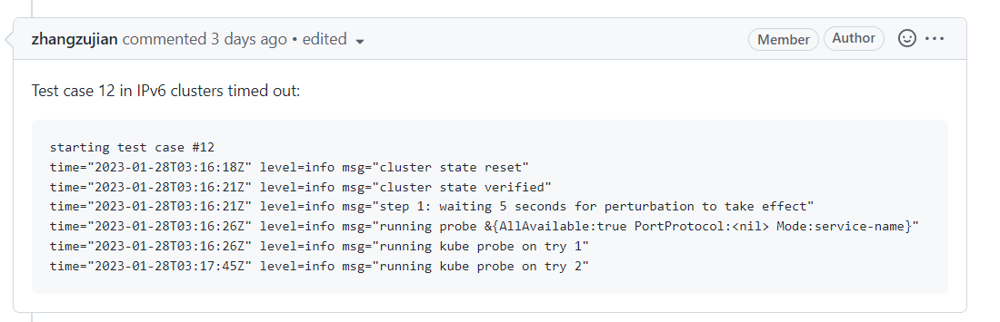
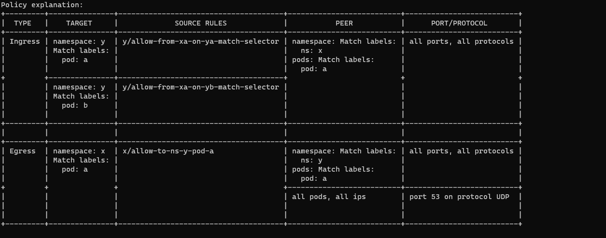

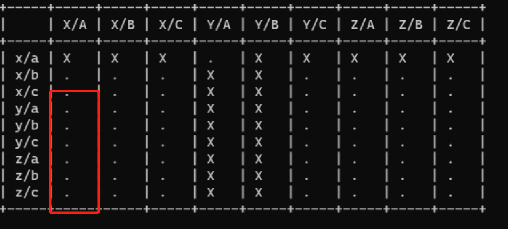
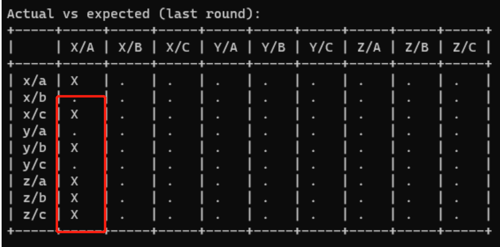
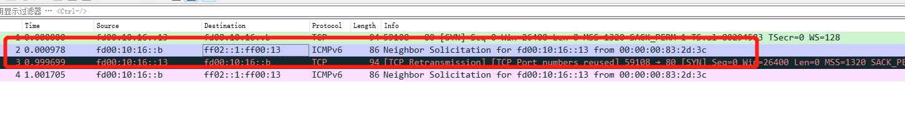
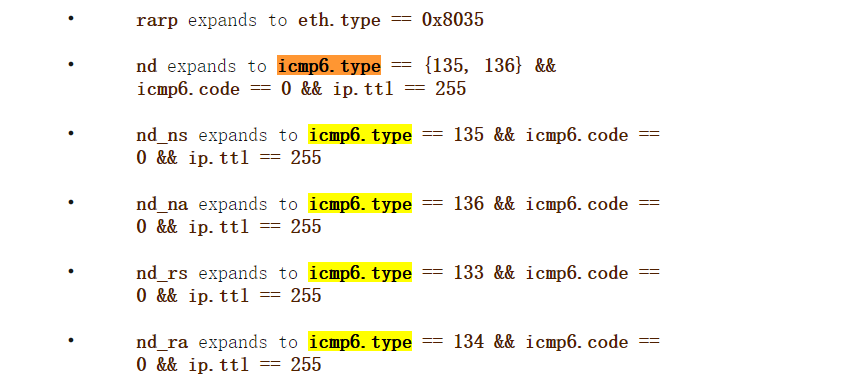
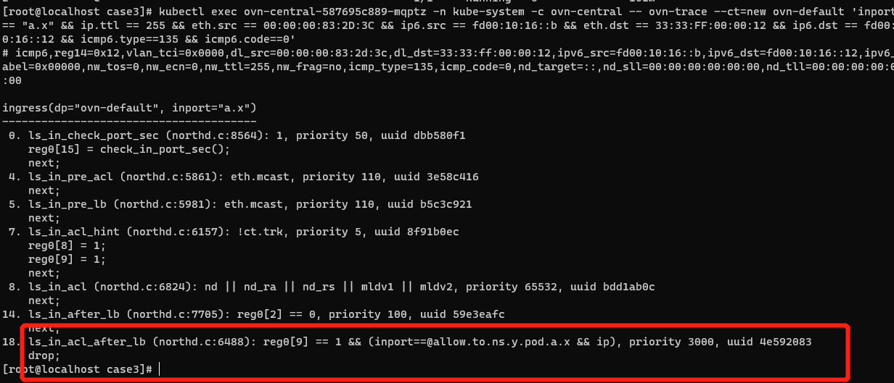
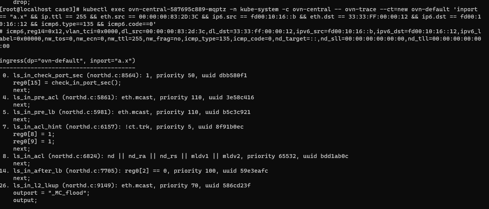
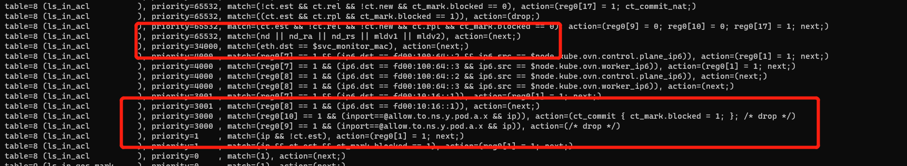
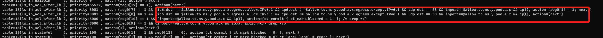
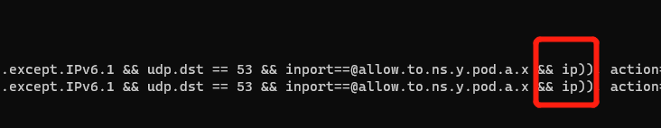
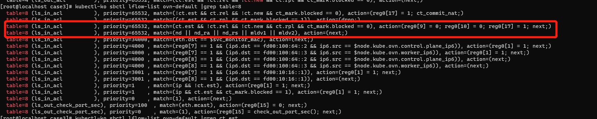
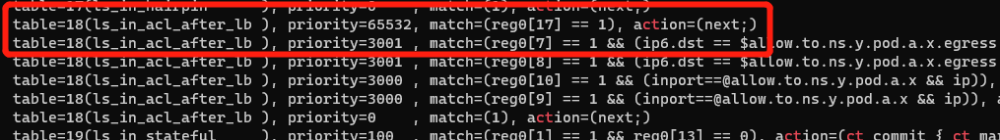
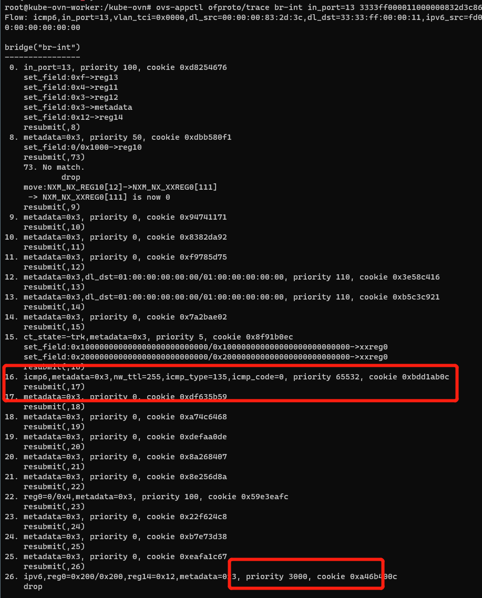
- Environment: IPv6 Kubernetes 集群 (kind 搭建), 使用 Kube-OVN 网络插件
- ls_in_acl
- ls_in_acl_after_lb
- apply-after-lb
- ovn-central
- kubectl ko trace
- ovs-appctl dpctl/dump-flows
- ovs-appctl dpctl/dump-conntrack
- fd00:10:16::/64
- Component: kube-Ovn
- Page ID: 136529996
- Original Title: egress acl options增加 apply-after-lb后 Cyclonus Network Policy E2E (ipv6) e2e failed
