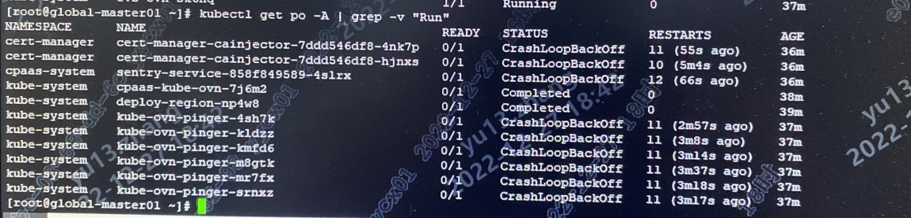
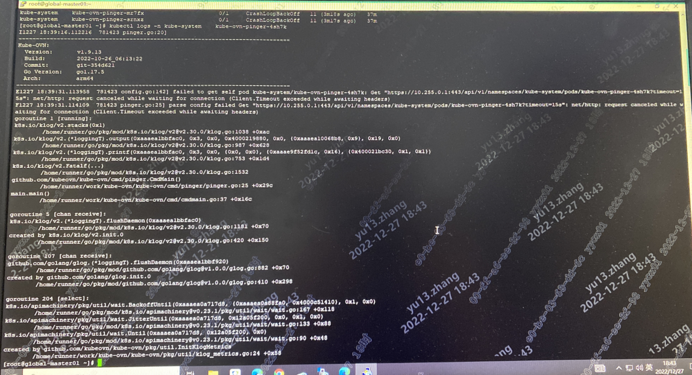

---
kind:
  - Troubleshooting
products:
  - Alauda Container Platform
  - Alauda DevOps
  - Alauda AI
  - Alauda Application Services
  - Alauda Service Mesh
  - Alauda Developer Portal
ProductsVersion:
  - 4.1.0,4.2.x
---
<!-- A type of document that involves encountering a fault, diagnosing it, performing root cause analysis, and providing solutions. -->

# 3.10.1

kube-ovn-pinger和cert-manager组件无法启动 容器内ping其他节点的容器ip不通 节点间到容器ip通信正常

## Cause
- 主机网卡驱动问题导致校验失败

## Resolution
- 在所有节点执行命令: ethtool -K ETH tx off (ETH替换为实际物理网卡名)

## [workaround]

## [Related Information]
**Screenshots**

- Environment: TKE 3.10.1版本, overlay网络模式, 鲲鹏操作系统, 内核版本4.19.90-24.4.v2101.ky10.arch64
- kube-ovn-pinger
- cert-manager
- ovn0网卡
- ethtool命令
- 物理网卡配置
- Component: kube-Ovn
- Page ID: 136531178
- Original Title: 3.10.1-部署TKE平台，ovn-pinger和cert-manager组件无法启动
