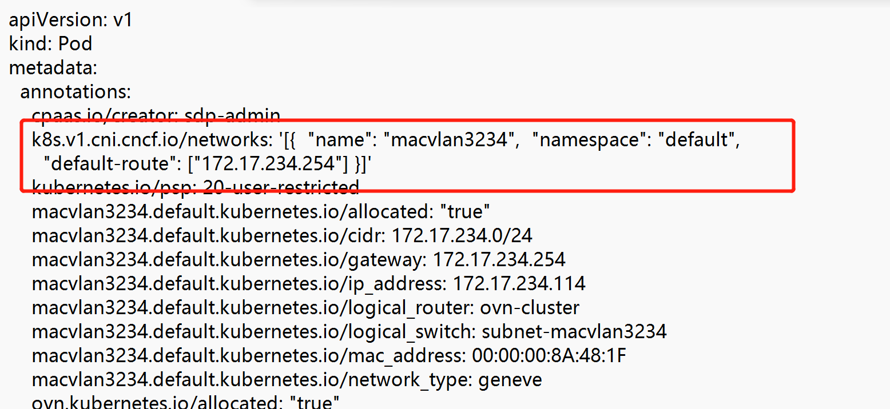
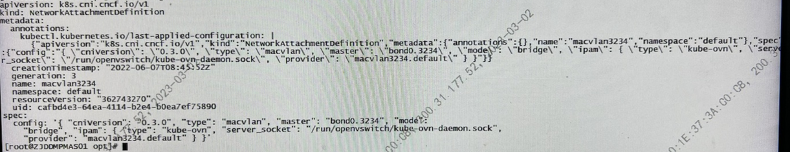
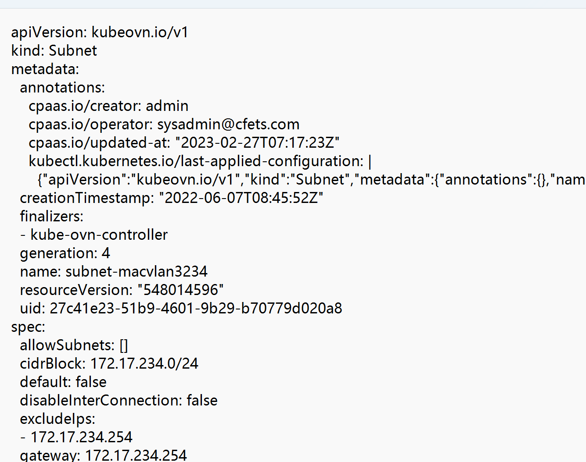
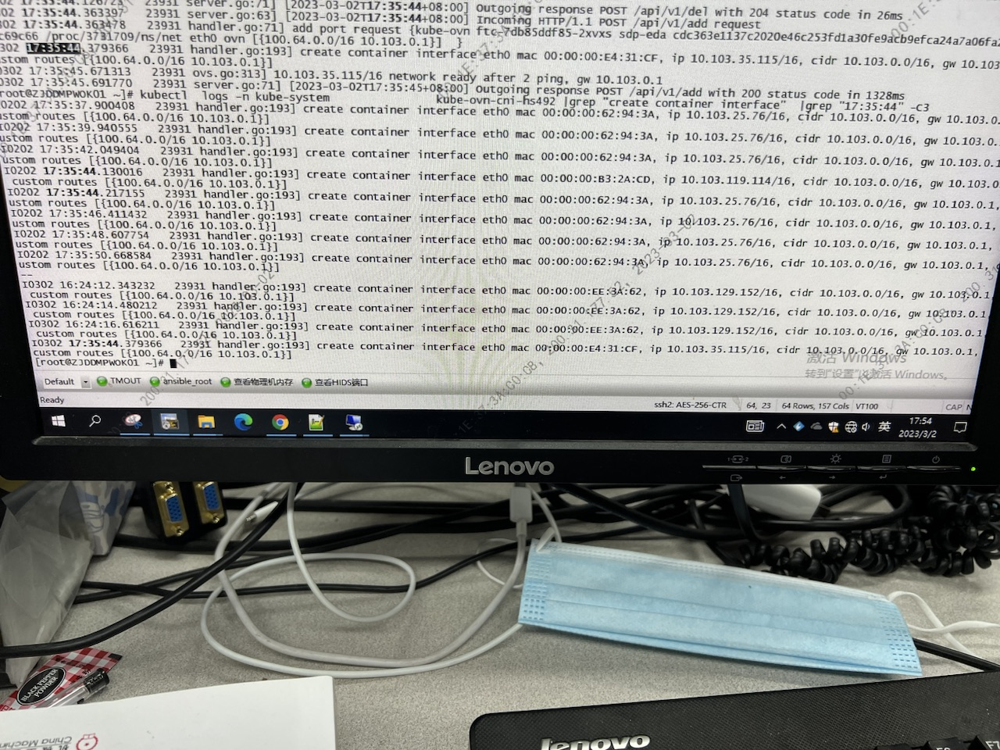
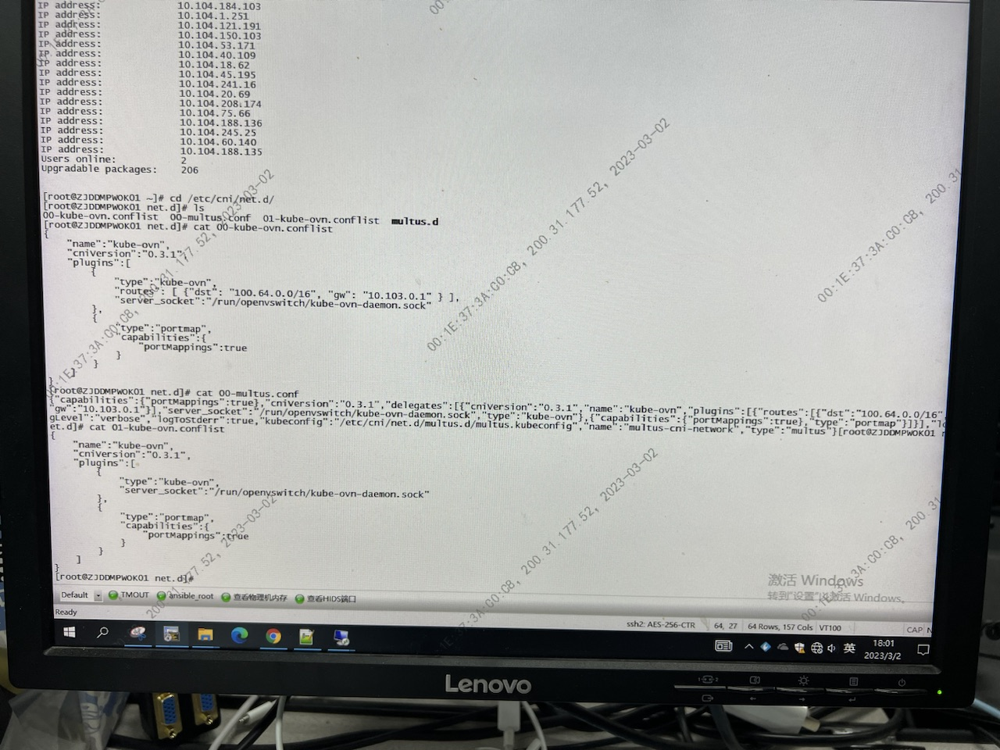
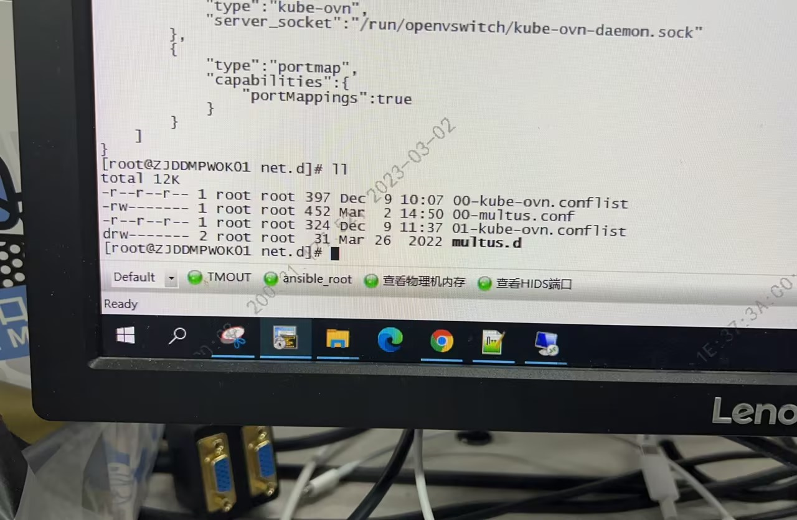

---kind:   - Troubleshootingproducts:    - Alauda Container Platform   - Alauda DevOps   - Alauda AI   - Alauda Application Services   - Alauda Service Mesh   - Alauda Developer PortalProductsVersion:   - 4.1.0,4.2.x---<!-- A type of document that involves encountering a fault, diag...it, performing root cause analysis, and providing solutions. --># 从 ovn双网卡pod的第二块网卡丢失## 关联JIRA [ZGWHJY-52](https://jira.alauda.cn/browse/ZGWHJY-52)## Cause## Resolution- 环境按照上面方案去搭建的双网卡环境，但是创建的pod没有第二张网卡。- ## 排查步骤- 1. 检查pod相关配置，networkattachment，subnet等相关多网卡yaml的配置正常- 2. 检查networkattachmentDefinition所在的bond0.3234,正常- 3. 检查kube-ovn-cni log 正常。- 4. 检查/etc/cni/net.d/的配置文件，发现会有00-kube-ovn.conflist和00-multus.conf，multus是读取编号最小的conf开始，所以这里可能冲突，暂时拿掉00-kube-ovn.conflist。重启multus ds,r然后重启业务pod，双网卡在pod中出现了。- ## 解决方法- 拿掉00-kube-ovn.conflist。重启multus ds,r然后重启业务pod，双网卡在pod中出现了。## [workaround]## [Related Information]**Screenshots**5. - 52- 16- 14- 38- 37- 3234- 19- 21- 24- 28- Component: kube-Ovn- Page ID: 140806071- Original Title: 从 ovn双网卡pod的第二块网卡丢失