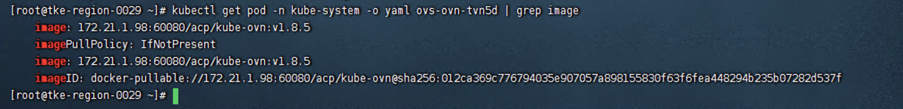
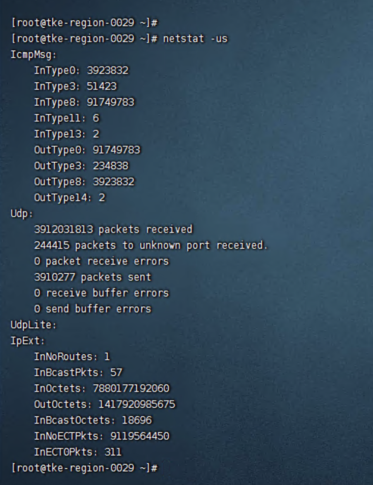
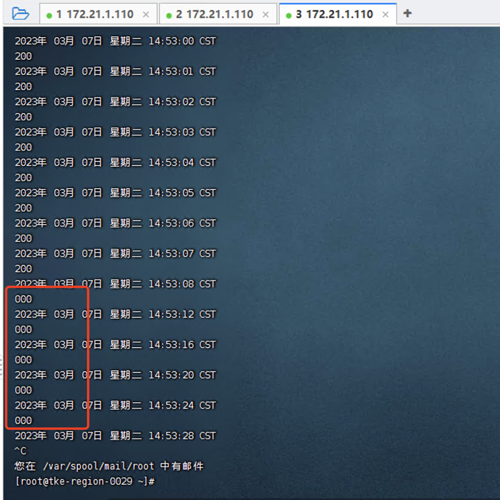
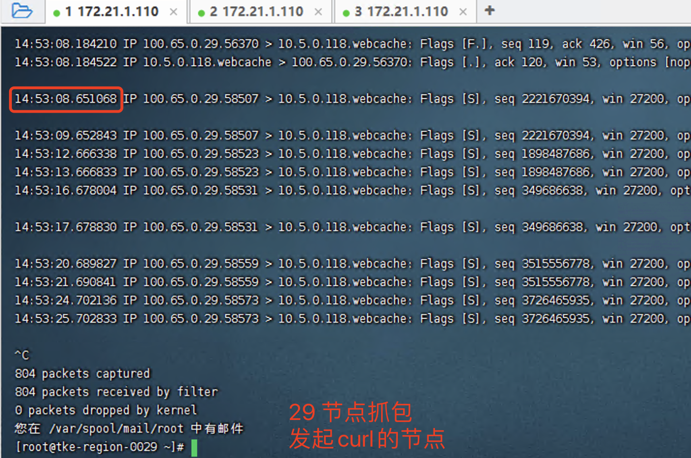
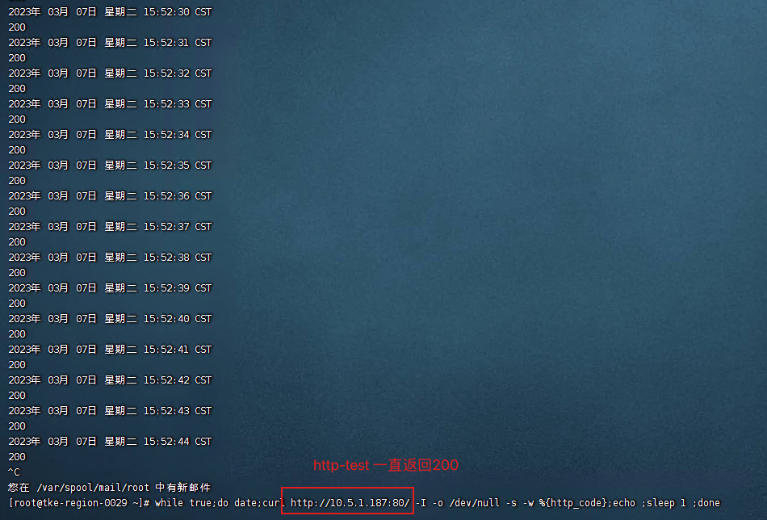
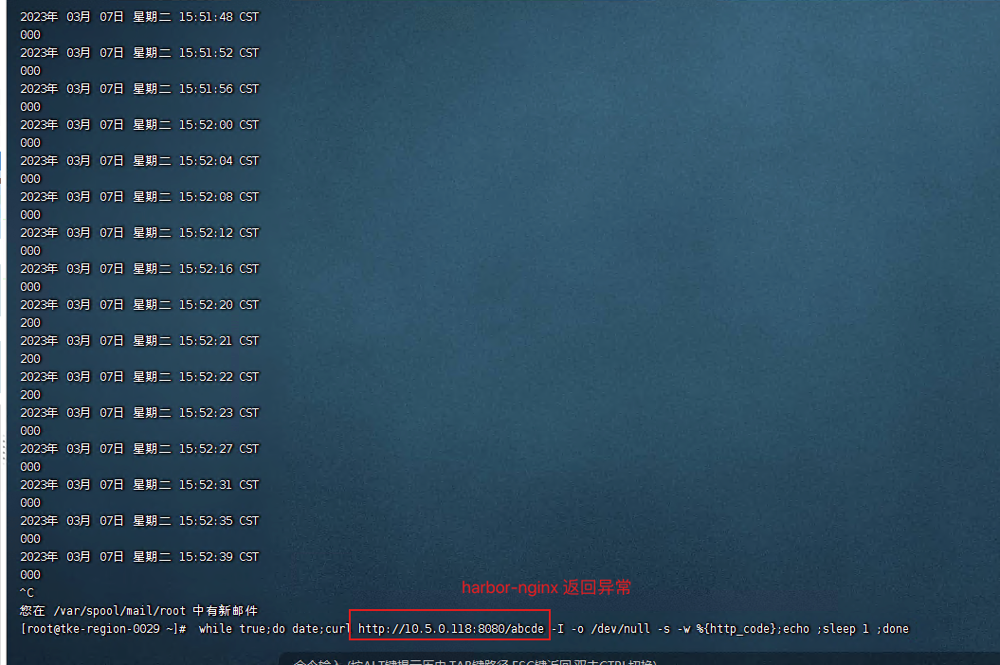

---
kind:
  - Troubleshooting
products:
  - Alauda Container Platform
  - Alauda DevOps
  - Alauda AI
  - Alauda Application Services
  - Alauda Service Mesh
  - Alauda Developer Portal
ProductsVersion:
  - 4.1.0,4.2.x
---
<!-- A type of document that involves encountering a fault, diagnosing it, performing root cause analysis, and providing solutions. -->

# kube

跨节点访问harbor-nginx pod时curl间断性不通 ping测试正常无丢包 抓包显示请求到达pod但无返回报文

## Cause
- harbor-nginx pod运行状态异常
- 应用层处理异常

## Resolution
- 检查harbor-nginx pod运行状态及配置
- 重启异常harbor-nginx pod

## [workaround]
- 使用相同镜像创建临时pod进行测试访问

## [Related Information]
**Screenshots**

- Environment: CNI版本：kube-ovn v1.8.3
- kube-ovn
- harbor-nginx pod
- pod网卡checksum配置
- Component: kube-ovn
- Page ID: 140806845
- Original Title: kube-ovn 网络，跨节点访问 harbor-nginx pod 丢包
