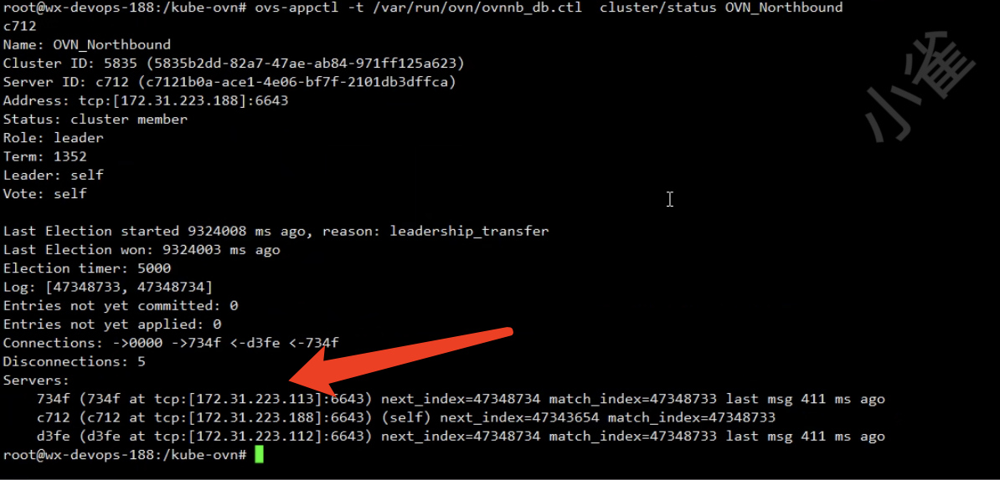
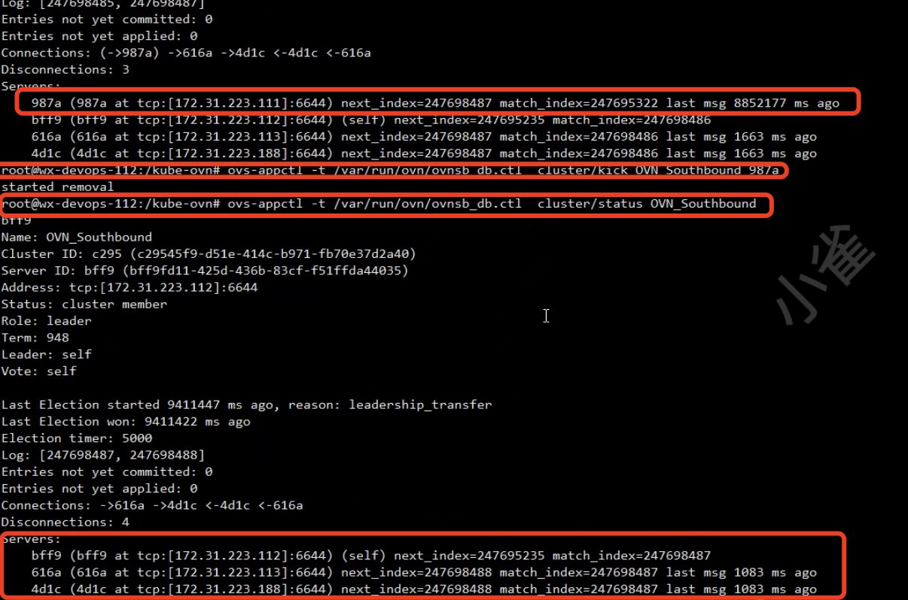

---
kind:
  - Troubleshooting
products:
  - Alauda Container Platform
  - Alauda DevOps
  - Alauda AI
  - Alauda Application Services
  - Alauda Service Mesh
  - Alauda Developer Portal
ProductsVersion:
  - 4.1.0,4.2.x
---
<!-- A type of document that involves encountering a fault, diagnosing it, performing root cause analysis, and providing solutions. -->

# 替换业务集群master节点并更换ip的情况下ovn/db/sb会保留历史master节点的信息，需要手动剔除历史节点

ovn/db/sb保留历史master节点信息

## Cause
- 替换业务集群master节点并变更ip后未自动清理ovn数据库记录

## Resolution
- kubectl get ep -n kube-system ovn-nb && kubectl exec -it -n kube-system ovn-central-xxx bash
- ovs-appctl -t /var/run/ovn/ovnnb_db.ctl cluster/kick OVN_Northbound <ID>
- kubectl get ep -n kube-system ovn-sb && kubectl exec -it -n kube-system ovn-central-xxx bash
- ovs-appctl -t /var/run/ovn/ovnsb_db.ctl cluster/kick OVN_Southbound <ID>

## [workaround]

## [Related Information]
**Screenshots**

- Environment: ovn
- ovn-nb
- ovn-sb
- ovn-central
- ovn-nbctl
- ovn-sbctl
- /var/run/ovn/ovnnb_db.ctl
- /var/run/ovn/ovnsb_db.ctl
- Component: kube-Ovn
- Page ID: 140816920
- Original Title: 替换业务集群master节点并更换ip的情况下ovn/db/sb会保留历史master节点的信息，需要手动剔除历史节点
