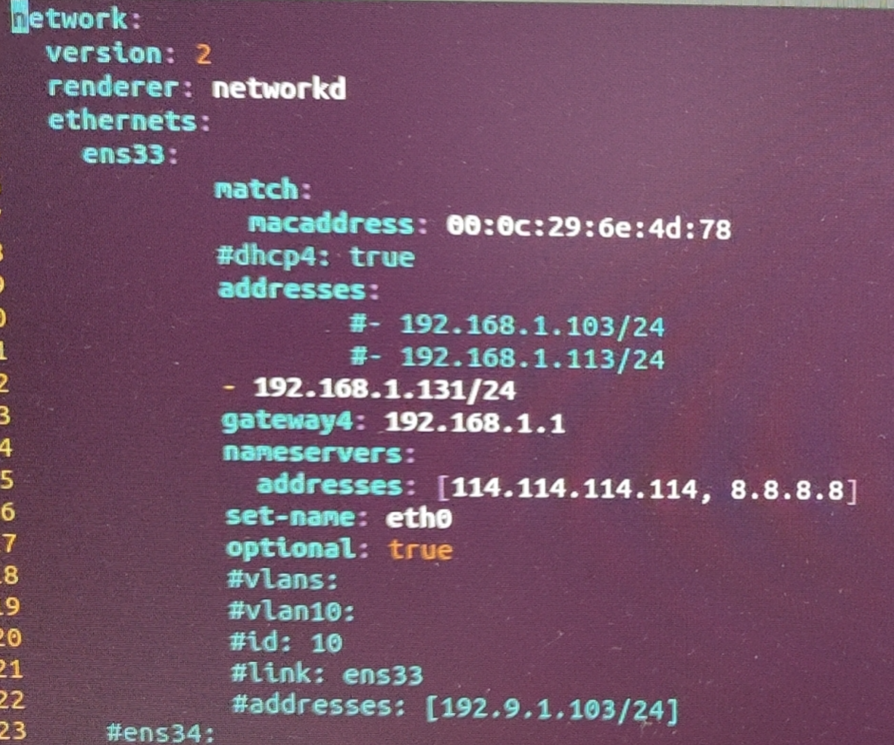

---kind:   - Troubleshootingproducts:    - Alauda Container Platform   - Alauda DevOps   - Alauda AI   - Alauda Application Services   - Alauda Service Mesh   - Alauda Developer PortalProductsVersion:   - 4.1.0,4.2.x---<!-- A type of document that involves encountering a fault, diag...it, performing root cause analysis, and providing solutions. --># 【Underlay】IP 转移功能在 Ubuntu 下失败IP 转移失败，导致节点网络中断 AddrReplace/RouteReplace 函数偶现报错：cannot assign requested address 物理网卡上的 IP/路由在转移过程中出现可疑变化## Cause- systemd-networkd 服务在 IP 转移过程中对网卡 IP/路由 进行了操作- kube-ovn-cni 与 systemd-networkd 的操作发生冲突## Resolution- 修改 kube-ovn-cni 代码，等待 systemd-networkd 操作完成后再执行 IP/路由转移## [workaround]## [Related Information]**Screenshots**- Environment: Ubuntu 18.04, Kube-OVN v1.9.21- kube-ovn-cni- systemd-networkd- netlink 事件- AddrReplace- RouteReplace- Component: Kubernetes- Page ID: 140817222- Original Title: 【Underlay】IP 转移功能在 Ubuntu 下失败