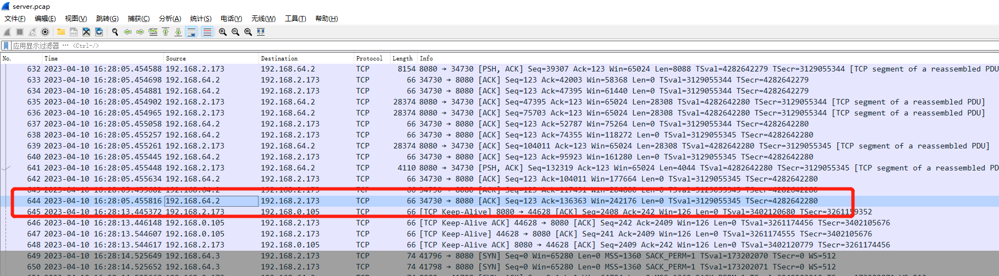
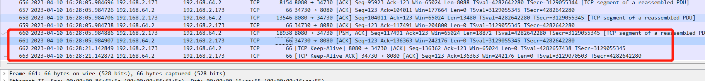
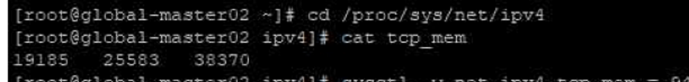
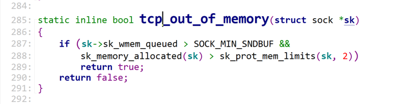

---kind:   - Troubleshootingproducts:    - Alauda Container Platform   - Alauda DevOps   - Alauda AI   - Alauda Application Services   - Alauda Service Mesh   - Alauda Developer PortalProductsVersion:   - 4.1.0,4.2.x---<!-- A type of document that involves encountering a fault, diag...it, performing root cause analysis, and providing solutions. --># wget 进度大概率到一半就hang住了wget下载进度到一半停止 无后续传输速度 内核报错TCP: out of memory## Cause- tcp_mem配置过低导致TCP内存耗尽## Resolution- sysctl -w net.ipv4.tcp_mem="196608 262144 393216"## [workaround]## [Related Information]**Screenshots**- Environment: Kernel 4.19.90, Kubernetes ACP 3.8.3, CNI kube-ovn v1.8.14, x86- net.ipv4.tcp_mem- /proc/net/sockstat- tcp_out_of_memory- sk_memeory_allocated- sk_prot_mem_limits- Component: Kubernetes- Page ID: 144904388- Original Title: wget 进度大概率到一半就hang住了