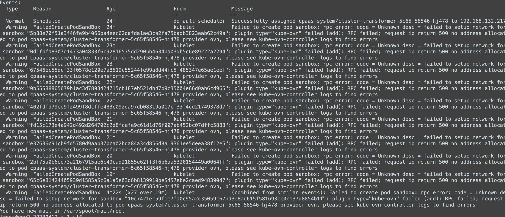
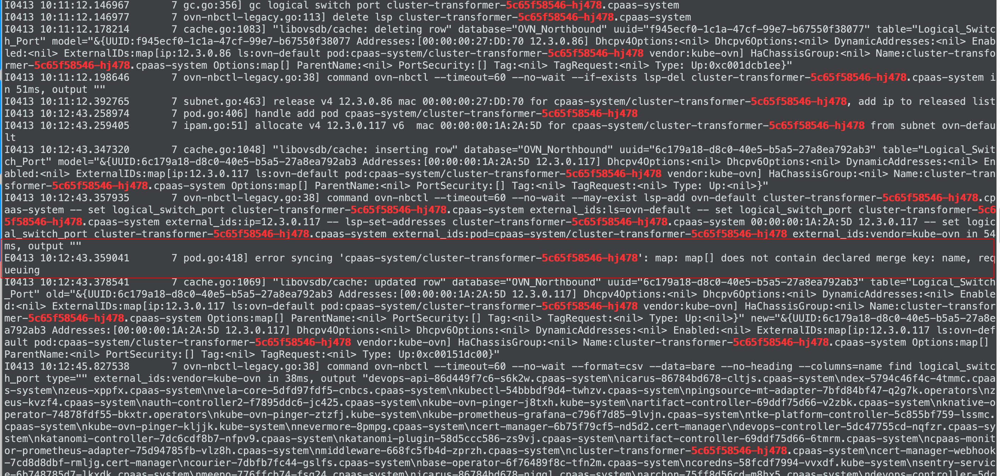
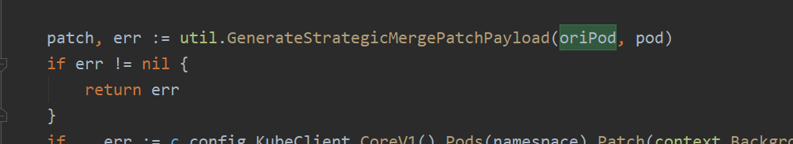
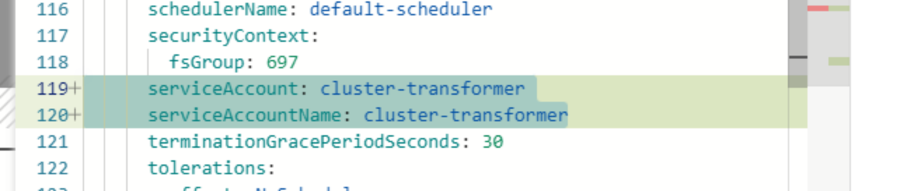

---
kind:
  - Troubleshooting
products:
  - Alauda Container Platform
  - Alauda DevOps
  - Alauda AI
  - Alauda Application Services
  - Alauda Service Mesh
  - Alauda Developer Portal
ProductsVersion:
  - 4.1.0,4.2.x
---
<!-- A type of document that involves encountering a fault, diagnosing it, performing root cause analysis, and providing solutions. -->

# 从 pod创建失败，报错ovn分配IP失败

Pod启动失败，报错ovn分配IP失败 kube-ovn-controller日志报错：error syncing 'cpaas-system/cluster-transformer-5c65f58546-hj478': map: map[] does not contain declared merge key: name, requeuing

## Cause
- serviceAccount中的imagePullSecrets字段包含空对象（- {}），导致kube-ovn-controller执行strategic merge时因缺少name键而失败

## Resolution
- 修复serviceAccount配置，在imagePullSecrets中添加name键值对（例如：{name: "test"}）

## [workaround]
- 移除deployment中serviceAccount和serviceAccountName的配置
- 在serviceAccount的imagePullSecrets中显式指定name字段

## [Related Information]
**Screenshots**

- Environment: 每日发版环境，CNI版本：Kube-OVN v1.11.3
- kube-ovn-controller
- serviceAccount
- imagePullSecrets
- strategic merge
- Component: kube-Ovn
- Page ID: 144909010
- Original Title: 从 pod创建失败，报错ovn分配IP失败
