---kind:   - Troubleshootingproducts:    - Alauda Container Platform   - Alauda DevOps   - Alauda AI   - Alauda Application Services   - Alauda Service Mesh   - Alauda Developer PortalProductsVersion:   - 4.1.0,4.2.x---<!-- A type of document that involves encountering a fault, diag...it, performing root cause analysis, and providing solutions. --># 宝信集中式子网问题容器网络的Pod访问集群外SVC地址不通 telnet测试失败## Cause- 网关节点NotReady触发切换时，静态路由被错误删除- subnet.status.activeGateway未及时更新导致路由丢失## Resolution- kubectl edit subnet 修改GatewayNode字段- 临时移除故障网关节点后更新子网配置- 网络恢复后重新添加网关节点## [workaround]- 手动调整subnet.Spec.GatewayNode触发路由重建## [Related Information]**Screenshots**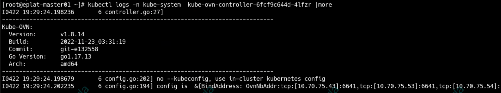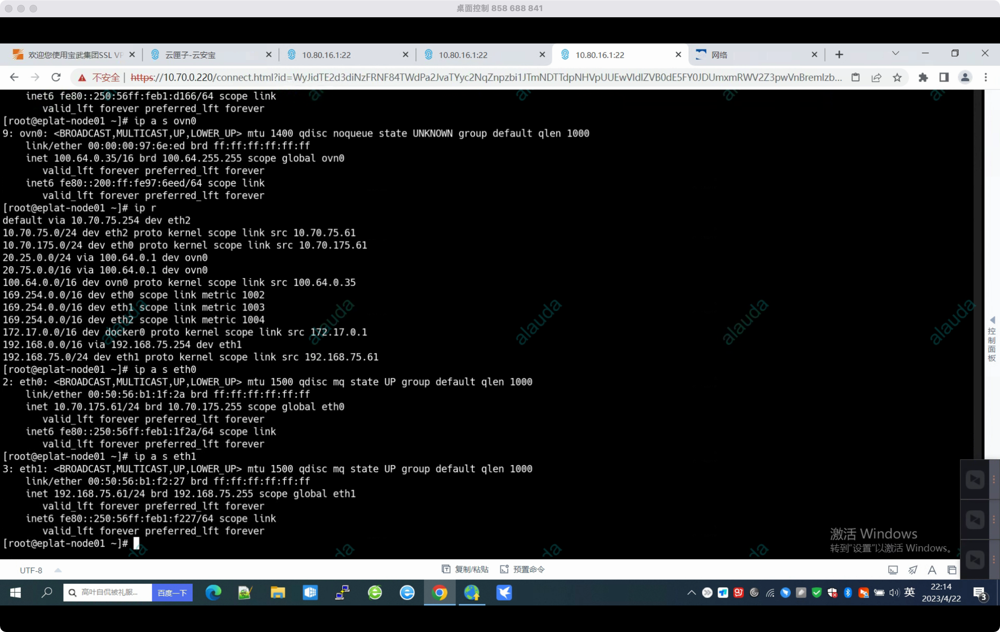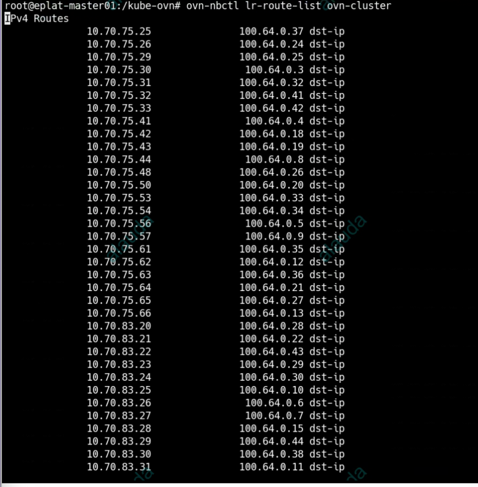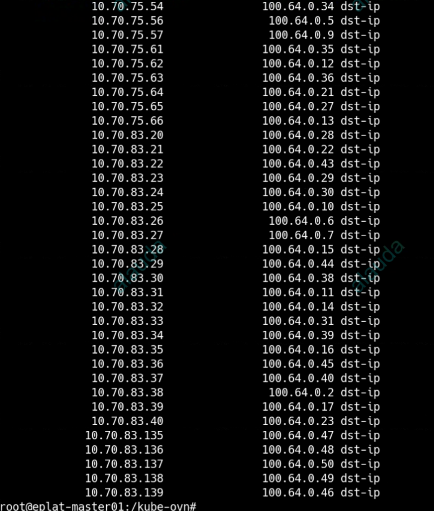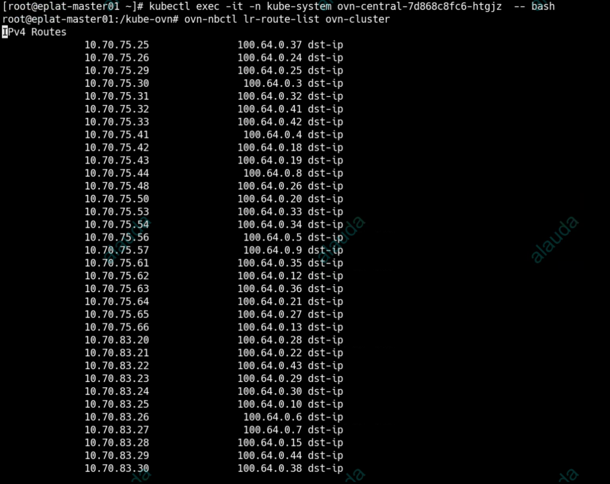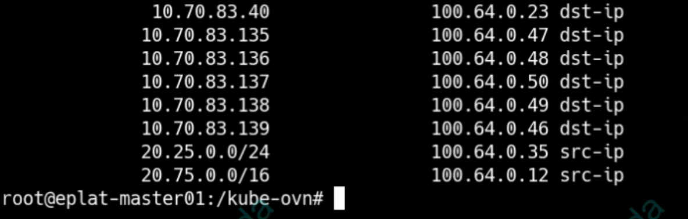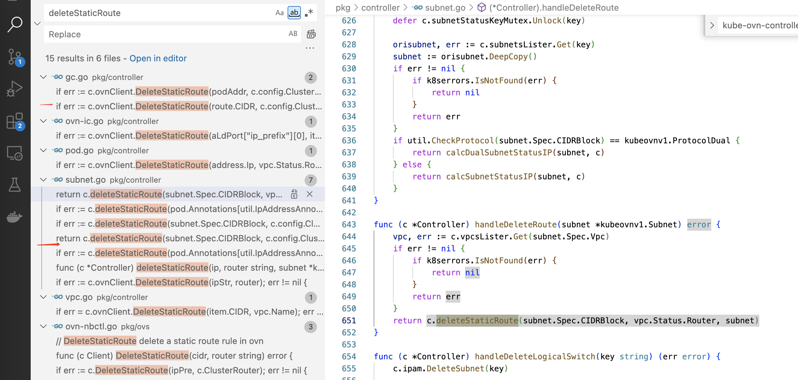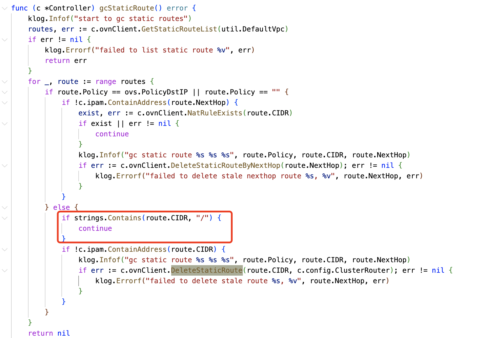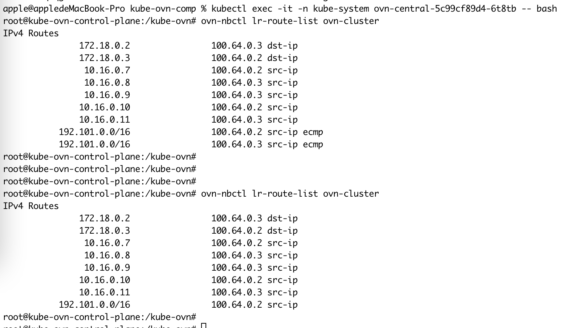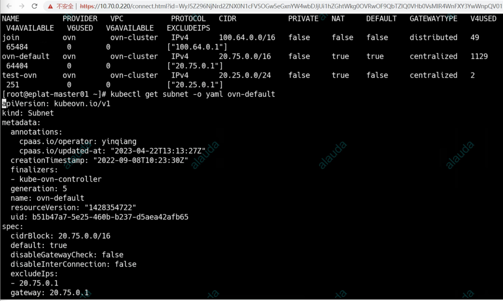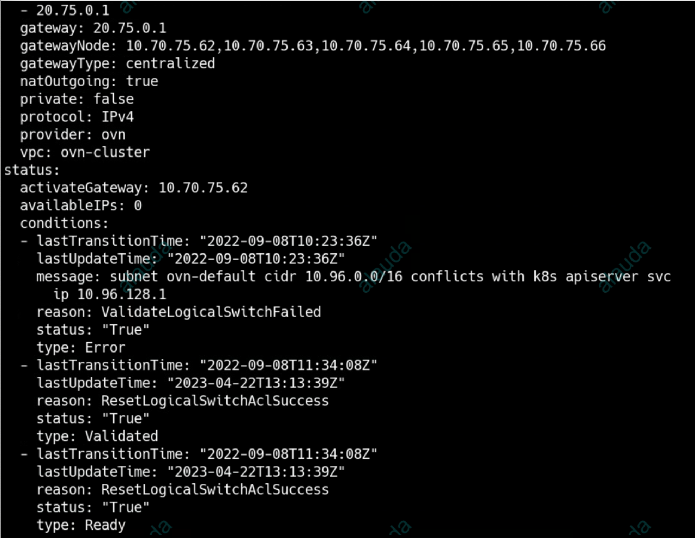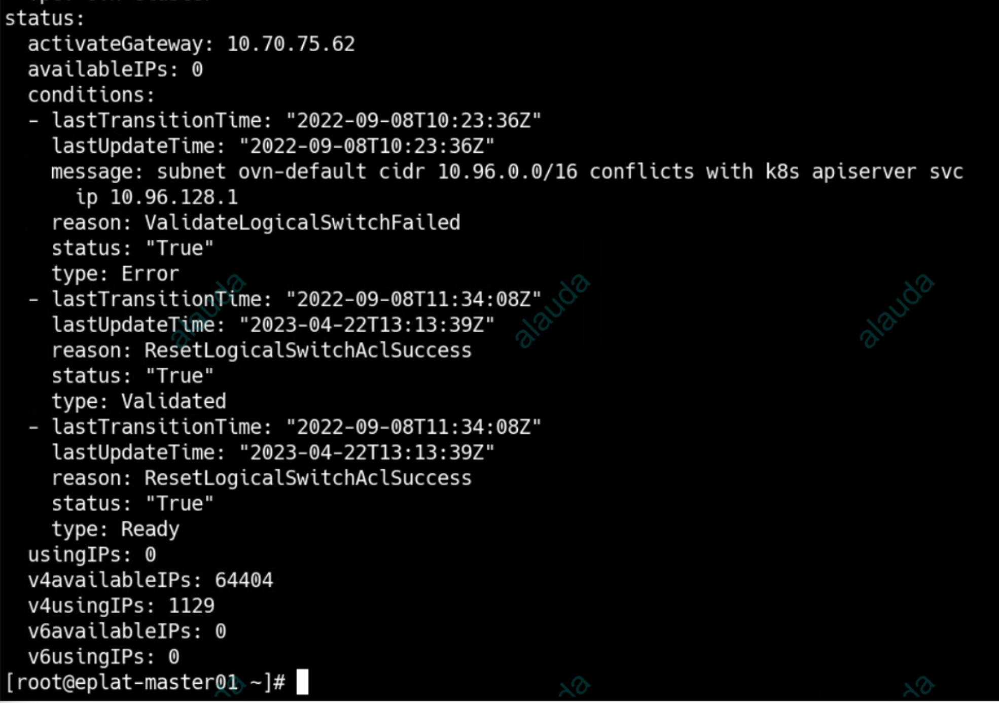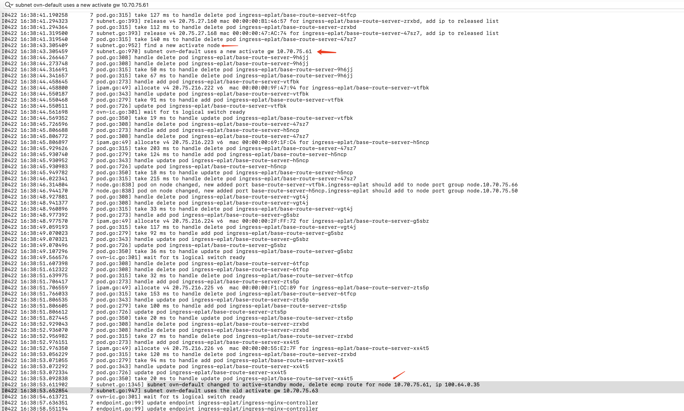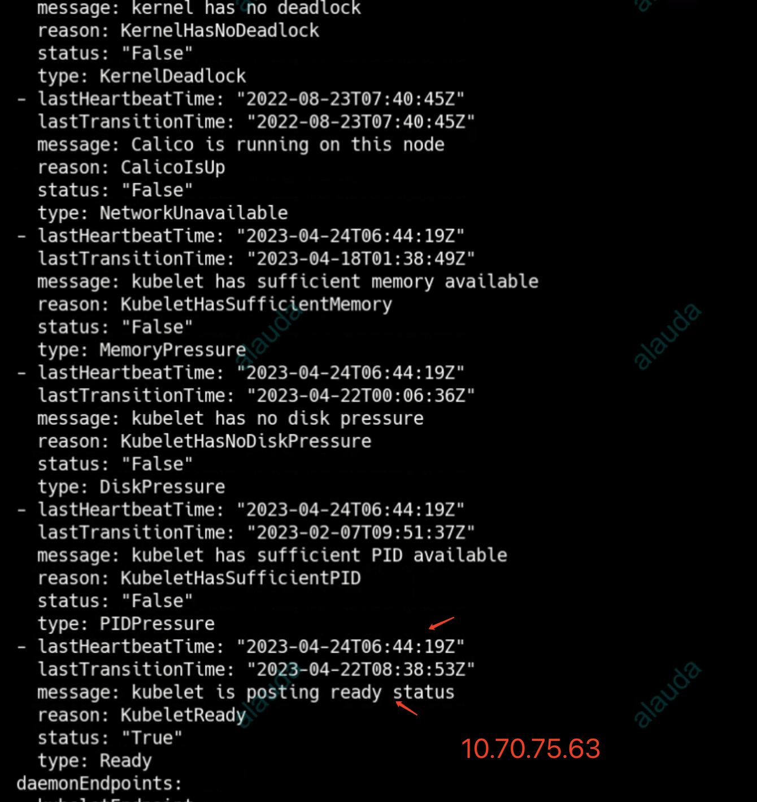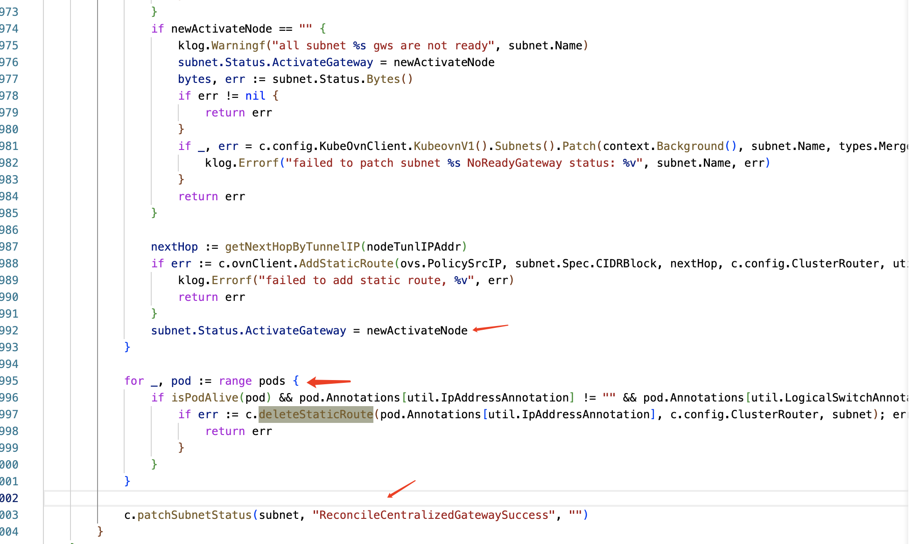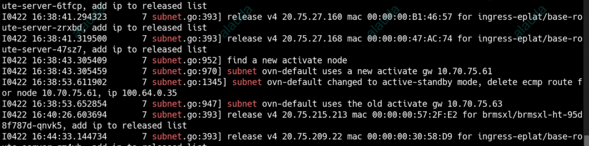- Environment: Kube-OVN v1.8.14- kube-ovn-controller- ovn-static-route- subnet.Spec.GatewayNode- subnet.status.activeGateway- ovn0- 10.70.75.0/24- Component: Kubernetes- Page ID: 146344755- Original Title: 宝信集中式子网问题