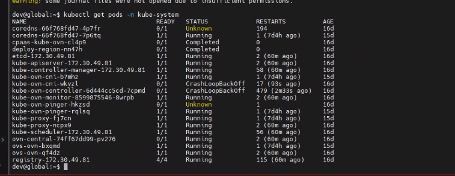
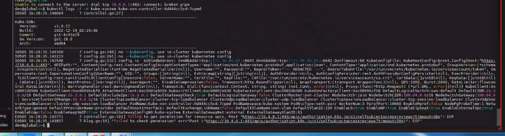
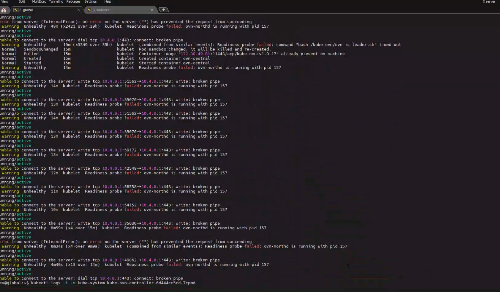
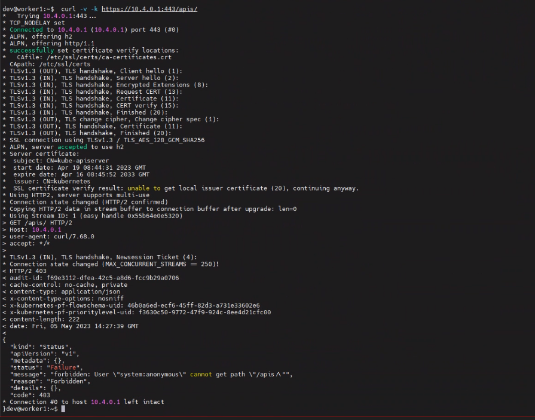
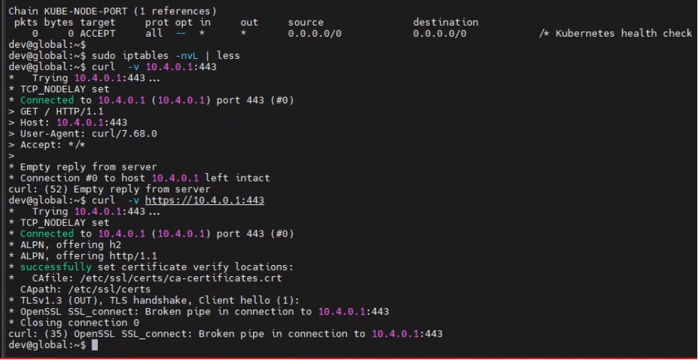
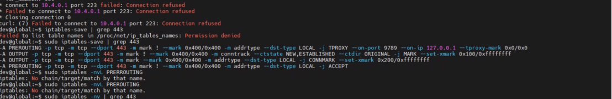
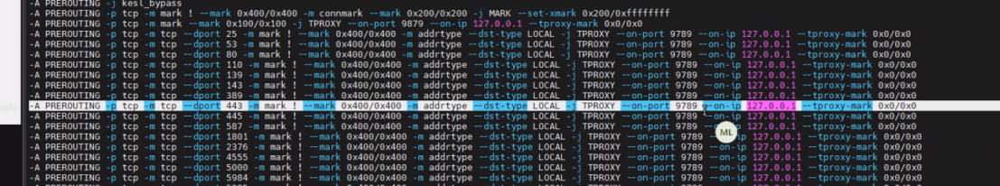
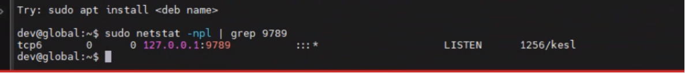
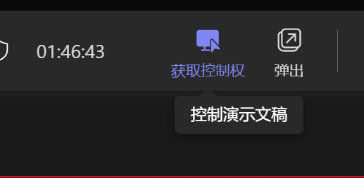

---kind:   - Troubleshootingproducts:    - Alauda Container Platform   - Alauda DevOps   - Alauda AI   - Alauda Application Services   - Alauda Service Mesh   - Alauda Developer PortalProductsVersion:   - 4.1.0,4.2.x---<!-- A type of document that involves encountering a fault, diag...it, performing root cause analysis, and providing solutions. --># 俄罗斯石油项目 kubekube-ovn组件无法启动 日志显示443端口访问异常 global节点curl请求被对端关闭## Cause- 卡巴斯基占用9789端口导致iptables规则异常## Resolution- systemctl关闭卡巴斯基服务## [workaround]## [Related Information]**Screenshots**- Environment: CNI版本:Kube-OVN v1.10.3- 443- 6443- 9780- 9789- kube-ovn-controller- ovn-central- iptables- kube-proxy- 卡巴斯基- Component: kube-ovn- Page ID: 146357321- Original Title: 俄罗斯石油项目 kube-ovn组件起不来