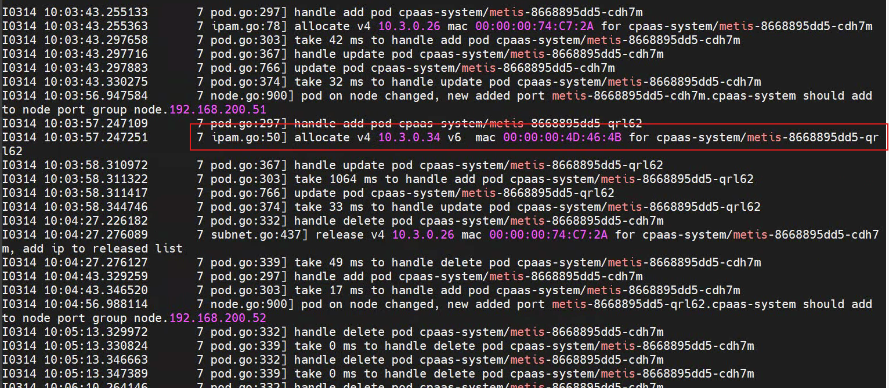

---
kind:
  - Troubleshooting
products:
  - Alauda Container Platform
  - Alauda DevOps
  - Alauda AI
  - Alauda Application Services
  - Alauda Service Mesh
  - Alauda Developer Portal
ProductsVersion:
  - 4.1.0,4.2.x
---
<!-- A type of document that involves encountering a fault, diagnosing it, performing root cause analysis, and providing solutions. -->

# ovn网络插件下配置集群互联后容器无法分配ip

region1和region2配置了集群互联，配置互联之后出现问题 ，region2 pod没问题。region1 集群的pod基本都出现故障，无法分配ip。 1、pod重启无法分配ip报错"request ip return 500 configure nic failed" 3、检查kube-ovn-controller日志，发现正常分配ip，但是对应容器确报错无法分配ip

## Cause

## Resolution
- 2、检查网络插件ovn容器状态均正常运行
- 4、检查ovn数据库存储的pod信息，已经存在记录，且ip正常分配
- ## 解决方案

## [workaround]

## [Related Information]
**Screenshots**

- 15
- 19
- 10
- 26
- 500
- 46
- 20
- 45
- 24
- /ovnwang-luo-cha-jian-xia-pei-zhi-ji-qun-hu-lian-hou-rong-qi-wu-fa-fen-pei-ip/image2023-5-11_14-15-26.png
- Component: kube-Ovn
- Page ID: 146362431
- Original Title: ovn网络插件下配置集群互联后容器无法分配ip
