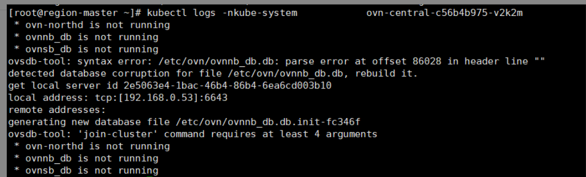

---
kind:
  - Troubleshooting
products:
  - Alauda Container Platform
  - Alauda DevOps
  - Alauda AI
  - Alauda Application Services
  - Alauda Service Mesh
  - Alauda Developer Portal
ProductsVersion:
  - 4.1.0,4.2.x
---
<!-- A type of document that involves encountering a fault, diagnosing it, performing root cause analysis, and providing solutions. -->

# 单节点ovn

单节点ovn-central无法启动 日志提示-detected database corruption for file /etc/ovn/ovnnb_db.db

## Cause
- 主机重启后ovnnb_db.db数据库文件损坏

## Resolution
- kubectl scale deployment -n kube-system --replicas=0 ovn-central
- mv /etc/origin/ovn/ovnnb_db.db /tmp
- kubectl scale deployment -n kube-system --replicas=1 ovn-central
- for ns in $(kubectl get ns --no-headers -o  custom-columns=NAME:.metadata.name); do for pod in $(kubectl get pod --no-headers -n "$ns" --field-selector spec.restartPolicy=Always -o custom-columns=NAME:.metadata.name,HOST:spec.hostNetwork | awk '{if ($2!="true") print $1}'); do kubectl delete pod "$pod" -n "$ns"; done; done

## [workaround]

## [Related Information]
**Screenshots**

- Environment: 通用版本
- /etc/ovn/ovnnb_db.db
- ovn-central
- kube-system
- spec.hostNetwork
- Component: kube-Ovn
- Page ID: 146364974
- Original Title: 单节点ovn-central无法启动日志提示-detected database corruption for file /etc/ovn/ovnnb_db.db, rebuild it
